# Mouse Genome Sequence

[GEO Accession viewer](https://www.ncbi.nlm.nih.gov/geo/query/acc.cgi?acc=GSE155145)

| Assay Type | RNA-Seq |
| --- | --- |
| Instrument | Illumina Genome Analyzer IIx |
| AvgSpotLen | 100 |
| DATASTORE filetype | FASTQ, SRA |
| Organism | Mus musculus |
| source_name | spermatozoa |

# Summary and Files

### KRONA IMAGES

[SRR12329253](https://trace.ncbi.nlm.nih.gov/Traces/sra/?run=SRR12329253&krona=on)

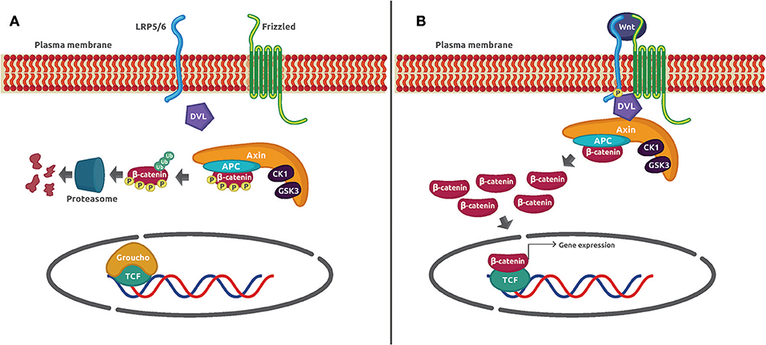

[SRR12329254](https://trace.ncbi.nlm.nih.gov/Traces/sra/?run=SRR12329254&krona=on)


[SRR12329255](https://trace.ncbi.nlm.nih.gov/Traces/sra/?run=SRR12329255&krona=on)


[SRR12329256](https://trace.ncbi.nlm.nih.gov/Traces/sra/?run=SRR12329256&krona=on)


### Before Trimming

### After Trimming

### Alignment Output

```bash
furkankykc@furkankykc:~/workspace/rnaseq/alignments/hisat2/mice$ hisat2 -p 8 --rg-id=SRR12329253 --rg SM:G1 --rg LB:NORMAL_SALINE --rg PU:CXX1234-ACTGAC.1 -x $REF_INDEX --dta --rna-strandness RF -U $DATA_DIR/cleaned/flexbarOut.fastq.gz  -S ./s_Rep1.sam
16593473 reads; of these:
16593473 (100.00%) were unpaired; of these:
7323478 (44.13%) aligned 0 times
8333462 (50.22%) aligned exactly 1 time
936533 (5.64%) aligned >1 times
55.87% overall alignment rate
```

```bash
furkankykc@furkankykc:~/workspace/rnaseq/alignments/hisat2/mice$ hisat2 -p 8 --rg-id=SRR12329255 --rg SM:G2 --rg LB:NICOTINE  --rg PU:CXX1234-ACTGAC.1 -x $REF_INDEX --dta --rna-strandness RF -U $DATA_DIR/cleaned/flexbarOut3.fastq.gz -S ./NCT_Rep1.sam
17910254 reads; of these:
17910254 (100.00%) were unpaired; of these:
8901839 (49.70%) aligned 0 times
7391604 (41.27%) aligned exactly 1 time
1616811 (9.03%) aligned >1 times
50.30% overall alignment rate
```

```bash
furkankykc@furkankykc:~/workspace/rnaseq/alignments/hisat2/mice$ hisat2 -p 8 --rg-id=SRR12329256 --rg SM:G2 --rg LB:NICOTINE --rg PU:CXX1234-ACTGAC.1 -x $REF_INDEX --dta --rna-strandness RF -U $DATA_DIR/cleaned/flexbarOut4.fastq.gz -S ./NCT_Rep2.sam
17913535 reads; of these:
17913535 (100.00%) were unpaired; of these:
9176681 (51.23%) aligned 0 times
7269897 (40.58%) aligned exactly 1 time
1466957 (8.19%) aligned >1 times
48.77% overall alignment rate
```

```bash
furkankykc@furkankykc:~/workspace/rnaseq/alignments/hisat2/mice/merged$ samtools flagstat NCT.bam
43301859 + 0 in total (QC-passed reads + QC-failed reads)
7478070 + 0 secondary
0 + 0 supplementary
0 + 0 duplicates
25223339 + 0 mapped (58.25% : N/A)
0 + 0 paired in sequencing
0 + 0 read1
0 + 0 read2
0 + 0 properly paired (N/A : N/A)
0 + 0 with itself and mate mapped
0 + 0 singletons (N/A : N/A)
0 + 0 with mate mapped to a different chr
0 + 0 with mate mapped to a different chr (mapQ>=5)
furkankykc@furkankykc:~/workspace/rnaseq/alignments/hisat2/mice/merged$ samtools flagstat SLN.bam
39545384 + 0 in total (QC-passed reads + QC-failed reads)
6358438 + 0 secondary
0 + 0 supplementary
0 + 0 duplicates
24898428 + 0 mapped (62.96% : N/A)
0 + 0 paired in sequencing
0 + 0 read1
0 + 0 read2
0 + 0 properly paired (N/A : N/A)
0 + 0 with itself and mate mapped
0 + 0 singletons (N/A : N/A)
0 + 0 with mate mapped to a different chr
0 + 0 with mate mapped to a different chr (mapQ>=5)
```

### Bam multiqc Results

### Normal Bam Result

[multiqc_report.html](data/multiqc_report.html)

### Merged Bam Result

[merged_multiqc_report.html](data/multiqc_report%201.html)

### R files

[kallisto_gene_matrix.pl](data/kallisto_gene_matrix.pl)

[top_sig_genes.R](data/top_sig_genes.r)

[Tutorial_edgeR.R](data/Tutorial_edgeR.r)

[Tutorial_KallistoSleuth.R](data/Tutorial_KallistoSleuth.r)

[Tutorial_Part1_ballgown.R](data/Tutorial_Part1_ballgown.r)

[Tutorial_Part2_ballgown.R](data/Tutorial_Part2_ballgown.r)

[Tutorial_Supplementary_R.R](data/Tutorial_Supplementary_R.r)

### Output Files

[SleuthResults.pdf](data/SleuthResults.pdf)

[Tutorial_Part2_ballgown_output.pdf](data/Tutorial_Part2_ballgown_output.pdf)

[Tutorial_Part3_Supplementary_R_output.pdf](data/Tutorial_Part3_Supplementary_R_output.pdf)

[myanno.mm10_multianno.tsv](data/myanno.mm10_multianno.tsv)

# Data and paper related questions

### My explanation about the findings

I found these genes from one of our pipelines according to these genes.

Cav2 gene effect apoptosis and cellular growth and also Klf6 gene has functions as a tumor suppressors. Down regulaton of this gene could be main reason of nicotine effect in cigarette smoke on carcinogenesis. Until now this signature of these two gene carries out canserous potential as they have effect on apoptosis which is cells presense self killing mechanizm and cellular growth. if this substance has potential role on broke one of these mechanisms or both. They are crucial even them self alone for establishing carcinogenesis. We can see in table there is also fer has an effect on cell growth mechanizm this is also proving for cav2 gene's diferential expression truthness which since this gene has also effect on growth mechanizm of cell. 

Moreover Axin2 gene has an effect on regulation of ß-cateninin mechanism since ß-cateinin has an active role of heteroygosity and this pathway also has an important role for patterning and fate determination of cell. And also this pathway’s relation with colon cancer and melanoma has been identified.

Ccnd2 genes expression shows us tumor suppressor protein Rb’s phosporilated in other word activated since there was no tumor there is no reason for this activation of suppressor protein .

β-catenin regulates NF-κB activity

More than one genes are showing us the NF-κB pathway regulation that plays a key role in regulating the immune response to infection. Incorrect regulation of NF-κB has been linked to cancer, inflammatory and [autoimmune diseases](https://en.wikipedia.org/wiki/Autoimmune_diseases), [septic shock](https://en.wikipedia.org/wiki/Septic_shock), [viral infection](https://en.wikipedia.org/wiki/Viral_infection), and improper immune development.

| Gene Name | Detail  |
| --- | --- |
| WNT9A | These proteins have been implicated in oncogenesis and in several developmental processes, including regulation of cell fate and patterning during embryogenesis. |
| CCM2 | The protein is required for normal cytoskeletal structure, cell-cell interactions, and lumen formation in endothelial cells. Mutations in this gene result in cerebral cavernous malformations. |
| Cav2 | The protein encoded by this gene is a major component of the inner surface of caveolae, small invaginations of the plasma membrane, and is involved in essential cellular functions, including signal transduction, lipid metabolism, cellular growth control and apoptosis. |
| Klf6 | This gene encodes a member of the Kruppel-like family of transcription factors. The zinc finger protein is a transcriptional activator, and functions as a tumor suppressor. Multiple transcript variants encoding different isoforms have been found for this gene, some of which are implicated in carcinogenesis. |
| Scmh1 | a Protein Coding gene |
| Cox5a | enzyme of the mitochondrial respiratory chain. |
| Fer | It regulates cell-cell adhesion and mediates signaling from the cell surface to the cytoskeleton via growth factor receptors. |
| Axin2 | Regulation of ß-catenin, maped to a region that shows frequent loss of heterozygosity in breast cancer, neuroblastoma, and other tumors. Mutations in this gene have been associated with colorectal cancer with defective mismatch repair. |
| Pih1d2 | a Protein Coding gene |
| Ccnd2 | This protein has been shown to interact with and be involved in the phosphorylation of tumor suppressor protein Rb. |
| Slfn4 | In malignant melanoma cells, gene expression is up-regulated in response to interferon alpha. |
| Trim25 | regulation of antiviral innate immunity |
| Abhd15
 | Gene Ontology (GO) annotations related to this gene include hydrolase activity
. |
| Stk11 | The STK11
 gene (also called LKB1) provides instructions for making an enzyme called serine/threonine kinase 11. This enzyme is a tumor suppressor, which means that it helps keep cells from growing and dividing too fast or in an uncontrolled way.        This kinase also promotes a type of programmed cell death known as apoptosis. |
| Ddx3x
 | The downstream genes of DDX3X-SP1-mediated transactivation include P21, KRAS, and MDM2 which are critical for cancer development and progression. DDX3X also interacts with YY1 to facilitate the transcription of genes involved in WNT/β-catenin signalling  |
| S100a6 | Growth Factor-Inducible Protein 2A9 (calcium binding protein) |
| Paf1 | The PAF1 complex interacts with RNA polymerase II and plays a role in transcription elongation as well as histone modifications including ubiquitylation and methylation |
| Dnase2a
 | The protein, located in the lysosome, hydrolyzes DNA under acidic conditions and mediates the breakdown of DNA during erythropoiesis and apoptosis. |
| Slbp
 | Histone Binding Protein |
| Sgta
 | Viral Protein U-Binding Protein |
| CD44 | The protein encoded by this gene is a cell-surface glycoprotein involved in cell-cell interactions, and may be related to tumor metastasis. |

### Comparation of my results and paper

> AKT/GSK3α/β signaling is involved in behavioral abnormalities mediated by the second class of dopamine receptors (D2s). So the expression level of protein AKT, GSK3α/β and the D2s were detected by western blot.
> 

GSK3α/β signaling pathway related with wnt/ß-cateinin

Acording to the paper of this data cigarette smoke causes apoptosis in germ cells which in the testis and nicotine which is most toxic chemical in cigarette smoke also affects telomerase damage of chrosomes. 

I found similar results but i coulnt come up with this result without any additional wetlab test.

### Where did i get this data?

I get both normal and data from same prjna , PRJNA648845; GEO: GSE155145

### What is my url for data

[https://www.ncbi.nlm.nih.gov/geo/query/acc.cgi?acc=GSE155145](https://www.ncbi.nlm.nih.gov/bioproject/PRJNA648845)

Mouse spermatoza control vs nicotine threatment

### Why did i choose this data?

## TruSeq DNA and RNA CD Indexes

Combinatorial dual (CD) index adapters (formerly TruSeq HT).

[Adapter Trimming](https://support-docs.illumina.com/SHARE/AdapterSeq/Content/SHARE/AdapterSeq/TruSeq/CDIndexes.htm#)

The following sequences are used for adapter trimming.

**Read 1**

AGATCGGAAGAGCACACGTCTGAACTCCAGTCA

**Read 2**

AGATCGGAAGAGCGTCGTGTAGGGAAAGAGTGT

## Path variables for DATA

```bash
export DATA_NAME=mice
export SNP_FILE=grcm38_snp_tran/genome_snp_tran
```

```bash
mkdir $RNA_HOME/bash -p
echo "source ~/.bashrc
export DATA_NAME=mice
export SNP_FILE=grcm38_snp_tran/genome_snp_tran
export DATA_DIR=$RNA_HOME/data/$DATA_NAME
export REFS_DIR=$RNA_HOME/refs/$DATA_NAME
export REF_INDEX=$REFS_DIR/$SNP_FILE
export REF_FASTA=$REFS_DIR/Mus_musculus.GRCm38.primary_assembly.all.fa
export RNA_BASH=$RNA_HOME/bash
export REF_GTF=$REFS_DIR/Mus_musculus.GRCm38.99.gtf
export ALIGN_DIR=$RNA_HOME/alignments/hisat2/$DATA_NAME
echo '$DATA_NAME activated'
" > $RNA_HOME/bash/$DATA_NAME
mkdir $DATA_DIR -p
mkdir $REFS_DIR -p
mkdir $ALIGN_DIR -p
source $RNA_HOME/bash/$DATA_NAME

```

```bash
source $RNA_BASH/$DATA_NAME
source $RNA_HOME/bash/mice
```

## Download DATA

```bash
mkdir $DATA_DIR/dump -p
cd $DATA_DIR/dump
touch SRP273677.txt
echo "SRR12329253
			SRR12329254
			SRR12329255
			SRR12329256" > SRP273677.txt
```

```bash
mkdir $DATA_DIR/default -p
cd $DATA_DIR/dump
$SRA_HOME/prefetch --option-file SRP273677.txt -p
$SRA_HOME/fasterq-dump --split-files SRR12329253 --outdir ../default -p
$SRA_HOME/fasterq-dump --split-files SRR12329254 --outdir ../default -p
$SRA_HOME/fasterq-dump --split-files SRR12329255 --outdir ../default -p
$SRA_HOME/fasterq-dump --split-files SRR12329256 --outdir ../default -p
```

### Report

```bash
cd $DATA_DIR/default
mkdir report
fastqc *.fastq -o report
cd report
multiqc .
open multiqc_report.html
```

[default_multiqc_report.html](data/multiqc_report%202.html)

| Sample Name | % Dups | % GC | M Seqs |
| --- | --- | --- | --- |
| SRR12329253 | 34.6% | 43% | 16.6 |
| SRR12329254 | 34.5% | 43% | 16.6 |
| SRR12329255 | 76.0% | 55% | 17.9 |
| SRR12329256 | 75.5% | 56% | 17.9 |

### Results

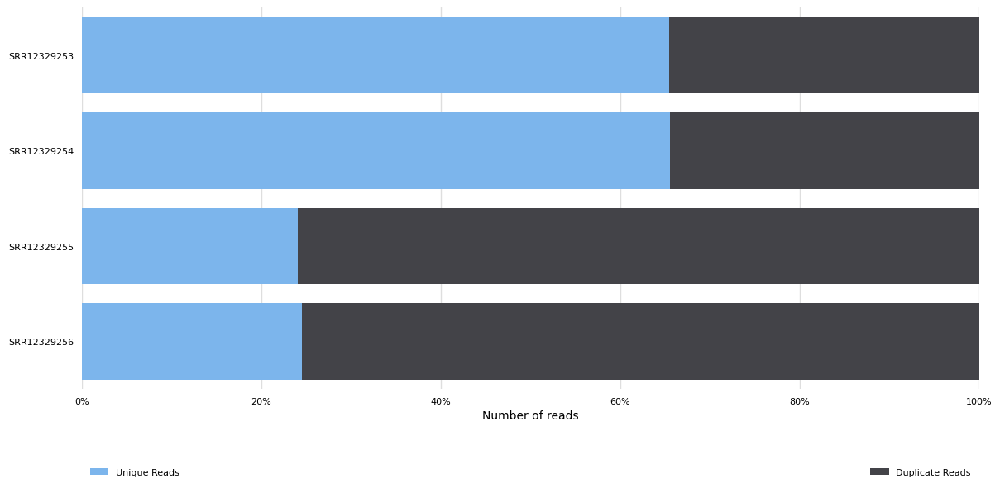

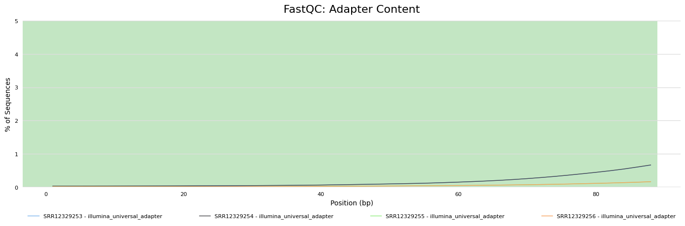

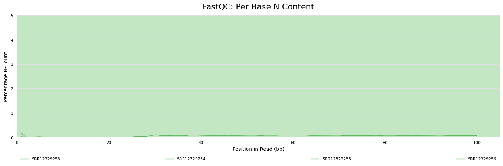

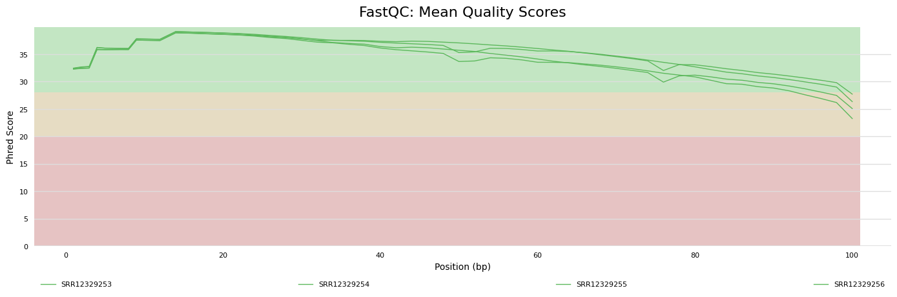

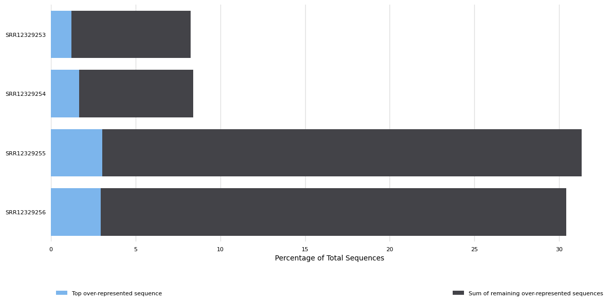

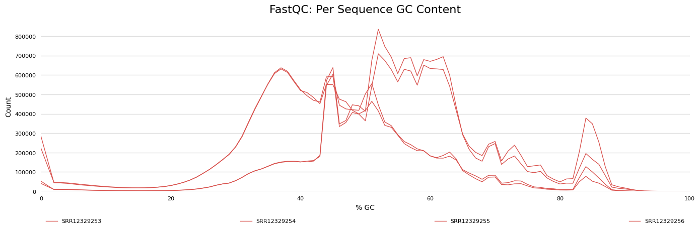

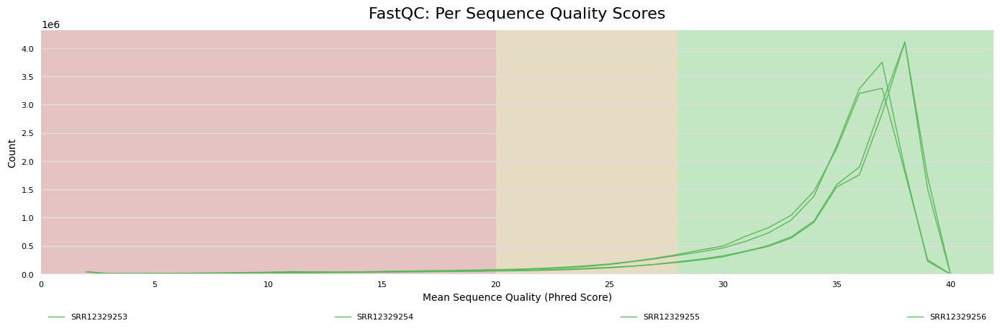

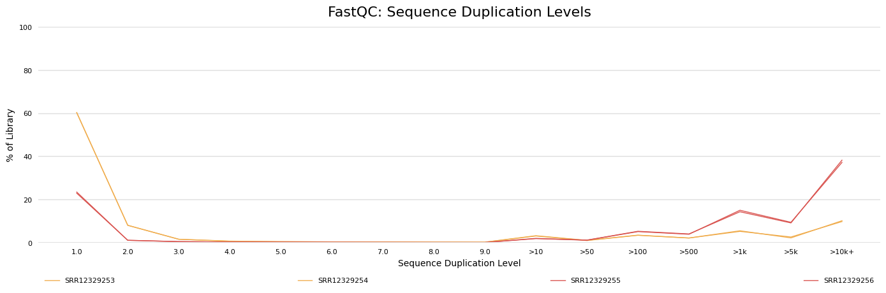

## Trim DATA

### Creating adapter files

| --- | --- |

```bash
mkdir  $DATA_DIR/adapters/ -p
cd $DATA_DIR/adapters/
touch forward.fa
touch reverse.fa
echo ">Illumina-trueseq-adapter-forward
			AGATCGGAAGAGCACACGTCTGAACTCCAGTCA" > forward.fa
echo ">Illumina-trueseq-adapter-forward
			AGATCGGAAGAGCGTCGTGTAGGGAAAGAGTGT" > reverse.fa

```

### Trimming with Flexbar

```bash
cd $DATA_DIR
flexbar -r default/SRR12329253.fastq --adapter-preset TruSeq -ap ON --max-uncalled 300 --min-read-length 25 --threads 8 --zip-output GZ --target cleaned/flexbarOut
flexbar -r default/SRR12329254.fastq --adapter-preset TruSeq -ap ON --max-uncalled 300 --min-read-length 25 --threads 8 --zip-output GZ --target cleaned/flexbarOut2
flexbar -r default/SRR12329255.fastq --adapter-preset TruSeq -ap ON --max-uncalled 300 --min-read-length 25 --threads 8 --zip-output GZ --target cleaned/flexbarOut3
flexbar -r default/SRR12329256.fastq --adapter-preset TruSeq -ap ON --max-uncalled 300 --min-read-length 25 --threads 8 --zip-output GZ --target cleaned/flexbarOut4

```

### Report

```bash
cd $DATA_DIR/cleaned
mkdir report
fastqc *.fastq.gz -o report
cd report
multiqc . -p

```

[trimmed_multiqc_report.html](data/multiqc_report%203.html)

### Results

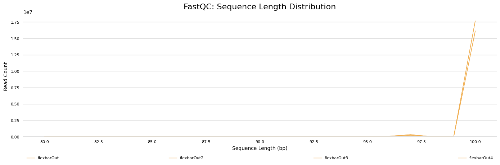


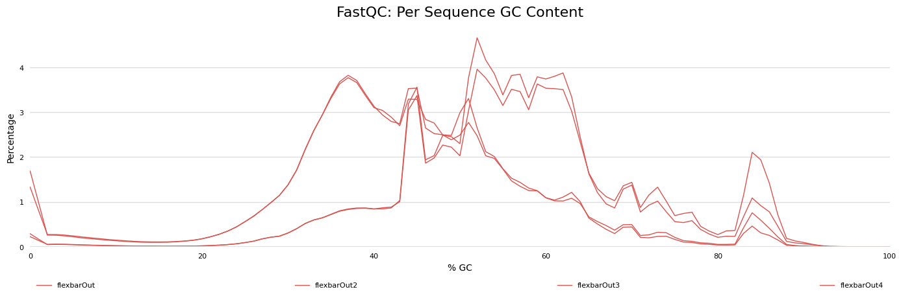


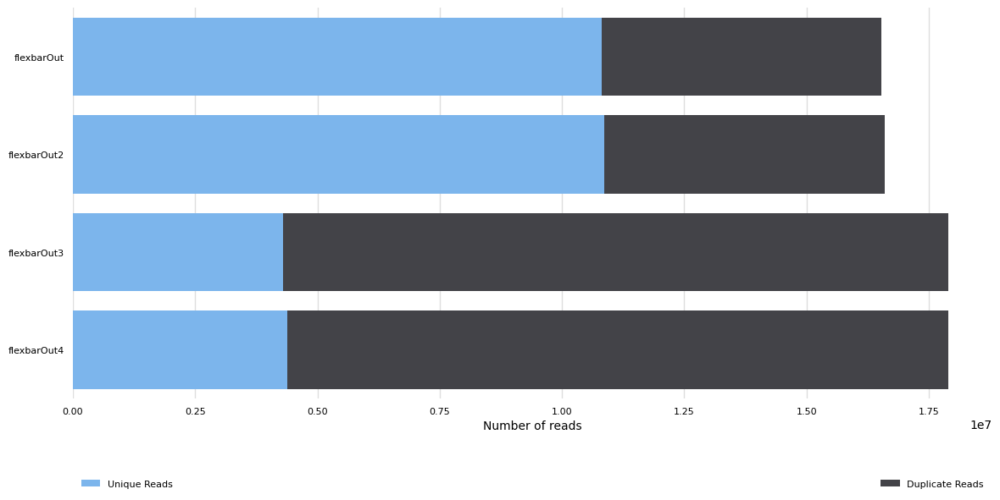


### Trimming with Flexbar2

```bash
cd $DATA_DIR
export folder=cleaned2
mkdir $folder
nohup flexbar -r default/SRR12329253.fastq --adapter-preset TruSeq -ap ON --max-uncalled 100 --min-read-length 80 --threads 8 --zip-output GZ --target $folder/flexbarOut > $folder/trim.log &
nohup flexbar -r default/SRR12329254.fastq --adapter-preset TruSeq -ap ON --max-uncalled 100 --min-read-length 80 --threads 8 --zip-output GZ --target $folder/flexbarOut2 > $folder/trim.log &
nohup flexbar -r default/SRR12329255.fastq --adapter-preset TruSeq -ap ON --max-uncalled 100 --min-read-length 80 --threads 8 --zip-output GZ --target $folder/flexbarOut3 > $folder/trim.log &
nohup flexbar -r default/SRR12329256.fastq --adapter-preset TruSeq -ap ON --max-uncalled 100 --min-read-length 80 --threads 8 --zip-output GZ --target $folder/flexbarOut4 > $folder/trim.log &

```

### Report

```bash
cd $DATA_DIR/$folder
mkdir report
fastqc *.fastq.gz -o report
cd report
multiqc .

```

## Align with Hisat2

### Download Ref File For HISAT2

```bash
cd $REFS_DIR
wget --content-disposition https://cloud.biohpc.swmed.edu/index.php/s/grcm38_snp_tran/download
tar -xvf grcm38_snp_tran.tar.gz

```

### UnTrimmed

### Align

```bash
cd $ALIGN_DIR
mkdir untrimmed
cd untrimmed
hisat2 -p 8 --rg-id=SRR12329253 --rg SM:G1 --rg LB:NORMAL_SALINE --rg PU:CXX1234-ACTGAC.1 -x $REF_INDEX --dta --rna-strandness RF -U $DATA_DIR/default/SRR12329253.fastq  -S ./SLN_Rep1.sam
hisat2 -p 8 --rg-id=SRR12329254 --rg SM:G1 --rg LB:NORMAL_SALINE --rg PU:CXX1234-ACTGAC.1 -x $REF_INDEX --dta --rna-strandness RF -U $DATA_DIR/default/SRR12329254.fastq -S ./SLN_Rep2.sam
hisat2 -p 8 --rg-id=SRR12329255 --rg SM:G2 --rg LB:NICOTINE  --rg PU:CXX1234-ACTGAC.1 -x $REF_INDEX --dta --rna-strandness RF -U $DATA_DIR/default/SRR12329255.fastq -S ./NCT_Rep1.sam
hisat2 -p 8 --rg-id=SRR12329256 --rg SM:G2 --rg LB:NICOTINE --rg PU:CXX1234-ACTGAC.1 -x $REF_INDEX --dta --rna-strandness RF -U $DATA_DIR/default/SRR12329256.fastq -S ./NCT_Rep2.sam

```

### Output

```bash
furkankykc@furkankykc:~/workspace/rnaseq/alignments/hisat2/mice/untrimmed$ hisat2 -p 8 --rg-id=SRR12329253 --rg SM:G1 --rg LB:NORMAL_SALINE --rg PU:CXX1234-ACTGAC.1 -x $REF_INDEX --dta --rna-strandness RF -U $DATA_DIR/default/SRR12329253.fastq  -S ./SLN_Rep1.sam
16600764 reads; of these:
16600764 (100.00%) were unpaired; of these:
7387185 (44.50%) aligned 0 times
8288561 (49.93%) aligned exactly 1 time
925018 (5.57%) aligned >1 times
55.50% overall alignment rate

```

```bash
furkankykc@furkankykc:~/workspace/rnaseq/alignments/hisat2/mice/untrimmed$ hisat2 -p 8 --rg-id=SRR12329254 --rg SM:G1 --rg LB:NORMAL_SALINE --rg PU:CXX1234-ACTGAC.1 -x $REF_INDEX --dta --rna-strandness RF -U $DATA_DIR/default/SRR12329254.fastq -S ./SLN_Rep2.sam
16600764 reads; of these:
16600764 (100.00%) were unpaired; of these:
7310965 (44.04%) aligned 0 times
8341694 (50.25%) aligned exactly 1 time
948105 (5.71%) aligned >1 times
55.96% overall alignment rate
```

```bash
furkankykc@furkankykc:~/workspace/rnaseq/alignments/hisat2/mice/untrimmed$ hisat2 -p 8 --rg-id=SRR12329255 --rg SM:G2 --rg LB:NICOTINE  --rg PU:CXX1234-ACTGAC.1 -x $REF_INDEX --dta --rna-strandness RF -U $DATA_DIR/default/SRR12329255.fastq -S ./NCT_Rep1.sam
17913626 reads; of these:
17913626 (100.00%) were unpaired; of these:
8919050 (49.79%) aligned 0 times
7381115 (41.20%) aligned exactly 1 time
1613461 (9.01%) aligned >1 times
50.21% overall alignment rate
```

```bash
furkankykc@furkankykc:~/workspace/rnaseq/alignments/hisat2/mice/untrimmed$ hisat2 -p 8 --rg-id=SRR12329256 --rg SM:G2 --rg LB:NICOTINE --rg PU:CXX1234-ACTGAC.1 -x $REF_INDEX --dta --rna-strandness RF -U $DATA_DIR/default/SRR12329256.fastq -S ./NCT_Rep2.sam
17913626 reads; of these:
17913626 (100.00%) were unpaired; of these:
9181073 (51.25%) aligned 0 times
7267111 (40.57%) aligned exactly 1 time
1465442 (8.18%) aligned >1 times
48.75% overall alignment rate
```

### Trimmed

### Align

```bash
cd $ALIGN_DIR
hisat2 -p 8 --rg-id=SRR12329253 --rg SM:G1 --rg LB:NORMAL_SALINE --rg PU:CXX1234-ACTGAC.1 -x $REF_INDEX --dta --rna-strandness RF -U $DATA_DIR/cleaned/flexbarOut.fastq.gz  -S ./SLN_Rep1.sam
hisat2 -p 8 --rg-id=SRR12329254 --rg SM:G1 --rg LB:NORMAL_SALINE --rg PU:CXX1234-ACTGAC.1 -x $REF_INDEX --dta --rna-strandness RF -U $DATA_DIR/cleaned/flexbarOut2.fastq.gz -S ./SLN_Rep2.sam
hisat2 -p 8 --rg-id=SRR12329255 --rg SM:G2 --rg LB:NICOTINE  --rg PU:CXX1234-ACTGAC.1 -x $REF_INDEX --dta --rna-strandness RF -U $DATA_DIR/cleaned/flexbarOut3.fastq.gz -S ./NCT_Rep1.sam
hisat2 -p 8 --rg-id=SRR12329256 --rg SM:G2 --rg LB:NICOTINE --rg PU:CXX1234-ACTGAC.1 -x $REF_INDEX --dta --rna-strandness RF -U $DATA_DIR/cleaned/flexbarOut4.fastq.gz -S ./NCT_Rep2.sam

```

### **Output**

```bash
furkankykc@furkankykc:~/workspace/rnaseq/alignments/hisat2/mice$ hisat2 -p 8 --rg-id=SRR12329253 --rg SM:G1 --rg LB:NORMAL_SALINE --rg PU:CXX1234-ACTGAC.1 -x $REF_INDEX --dta --rna-strandness RF -U $DATA_DIR/cleaned/flexbarOut.fastq.gz  -S ./SLN_Rep1.sam
16593473 reads; of these:
16593473 (100.00%) were unpaired; of these:
7323478 (44.13%) aligned 0 times
8333462 (50.22%) aligned exactly 1 time
936533 (5.64%) aligned >1 times
55.87% overall alignment rate
furkankykc@furkankykc:~/workspace/rnaseq/alignments/hisat2/mice$ hisat2 -p 8 --rg-id=SRR12329254 --rg SM:G1 --rg LB:NORMAL_SALINE --rg PU:CXX1234-ACTGAC.1 -x $REF_INDEX --dta --rna-strandness RF -U $DATA_DIR/cleaned/flexbarOut2_1.fastq.gz -2 $DATA_DIR/cleaned/flexbarOut2_2.fastq.gz -S ./SLN_Rep2.sam
(ERR): Different number of files specified with --reads/-1 as with -2
Exiting now ...
furkankykc@furkankykc:~/workspace/rnaseq/alignments/hisat2/mice$ hisat2 -p 8 --rg-id=SRR12329255 --rg SM:G2 --rg LB:NICOTINE  --rg PU:CXX1234-ACTGAC.1 -x $REF_INDEX --dta --rna-strandness RF -U $DATA_DIR/cleaned/flexbarOut3.fastq.gz -S ./NCT_Rep1.sam
17910254 reads; of these:
17910254 (100.00%) were unpaired; of these:
8901839 (49.70%) aligned 0 times
7391604 (41.27%) aligned exactly 1 time
1616811 (9.03%) aligned >1 times
50.30% overall alignment rate
furkankykc@furkankykc:~/workspace/rnaseq/alignments/hisat2/mice$ hisat2 -p 8 --rg-id=SRR12329256 --rg SM:G2 --rg LB:NICOTINE --rg PU:CXX1234-ACTGAC.1 -x $REF_INDEX --dta --rna-strandness RF -U $DATA_DIR/cleaned/flexbarOut4.fastq.gz -S ./NCT_Rep2.sam
17913535 reads; of these:
17913535 (100.00%) were unpaired; of these:
9176681 (51.23%) aligned 0 times
7269897 (40.58%) aligned exactly 1 time
1466957 (8.19%) aligned >1 times
48.77% overall alignment rate
```

### Trimmed2

### Align

```bash
cd $ALIGN_DIR
mkdir $folder
cd $folder
nohup hisat2 -p 8 --rg-id=SRR12329253 --rg SM:G1 --rg LB:SALINE --rg PU:CXX1234-ACTGAC.1 -x $REF_INDEX --dta --rna-strandness RF -U $DATA_DIR/$folder/flexbarOut.fastq.gz  -S ./SLN_Rep1.sam > align1.log &
nohup hisat2 -p 8 --rg-id=SRR12329254 --rg SM:G1 --rg LB:SALINE --rg PU:CXX1234-ACTGAC.1 -x $REF_INDEX --dta --rna-strandness RF -U $DATA_DIR/$folder/flexbarOut2.fastq.gz -S ./SLN_Rep2.sam > align2.log &
nohup hisat2 -p 8 --rg-id=SRR12329255 --rg SM:G1 --rg LB:NICOTINE --rg PU:CXX1234-ACTGAC.1 -x $REF_INDEX --dta --rna-strandness RF -U $DATA_DIR/$folder/flexbarOut3.fastq.gz -S ./NCT_Rep1.sam > align3.log &
nohup hisat2 -p 8 --rg-id=SRR12329256 --rg SM:G2 --rg LB:NICOTINE --rg PU:CXX1234-ACTGAC.1 -x $REF_INDEX --dta --rna-strandness RF -U $DATA_DIR/$folder/flexbarOut4.fastq.gz -S ./NCT_Rep2.sam > align4.log &

```

### **Output**

```bash
#SRR12329253 
16524813 reads; of these:
  16524813 (100.00%) were unpaired; of these:
    7295172 (44.15%) aligned 0 times
    8303692 (50.25%) aligned exactly 1 time
    925949 (5.60%) aligned >1 times
55.85% overall alignment rate
#SRR12329254
16591380 reads; of these:
  16591380 (100.00%) were unpaired; of these:
    7294225 (43.96%) aligned 0 times
    8347677 (50.31%) aligned exactly 1 time
    949478 (5.72%) aligned >1 times
56.04% overall alignment rate
#SRR12329255
17892194 reads; of these:
  17892194 (100.00%) were unpaired; of these:
    8894122 (49.71%) aligned 0 times
    7384238 (41.27%) aligned exactly 1 time
    1613834 (9.02%) aligned >1 times
50.29% overall alignment rate
#SRR12329256
17903191 reads; of these:
  17903191 (100.00%) were unpaired; of these:
    9169126 (51.22%) aligned 0 times
    7268855 (40.60%) aligned exactly 1 time
    1465210 (8.18%) aligned >1 times
48.78% overall alignment rate
```

### Comparison by Trim

| SSR NO | UnTrimmed | Trimmed  | Trimmed_2 |
| --- | --- | --- | --- |
| SRR12329253 | 49.93% aligned exactly 1 time
55.50% overall alignment rate | 50.22% aligned exactly 1 time
55.87% overall alignment rate | 50.25% aligned exactly 1 time
55.85% overall alignment rate |
| SRR12329254 | 50.25% aligned exactly 1 time
55.96% overall alignment rate | 50.27% aligned exactly 1 time
56.01% overall alignment rate | 50.31% aligned exactly 1 time
56.04% overall alignment rate |
| SRR12329255 | 41.20% aligned exactly 1 time
50.21% overall alignment rate | 41.27% aligned exactly 1 time
50.30% overall alignment rate | 41.27% aligned exactly 1 time
50.29% overall alignment rate |
| SRR12329256 | 40.57% aligned exactly 1 time
48.75% overall alignment rate |  40.58% aligned exactly 1 time
48.77% overall alignment rate | 40.60% aligned exactly 1 time
48.78% overall alignment rate |

### Convert sam files to bam files

```bash
samtools sort -@ 8 -o NCT_Rep1.bam NCT_Rep1.sam
samtools sort -@ 8 -o NCT_Rep2.bam NCT_Rep2.sam
samtools sort -@ 8 -o SLN_Rep1.bam SLN_Rep1.sam
samtools sort -@ 8 -o SLN_Rep2.bam SLN_Rep2.sam

```

### Create Index Files

```bash
samtools index -b SLN_Rep1.bam
samtools index -b SLN_Rep2.bam
samtools index -b NCT_Rep1.bam
samtools index -b NCT_Rep2.bam
```

### Merge bam Files

```bash
mkdir merged
java -Xmx2g -jar $RNA_HOME/student_tools/picard.jar MergeSamFiles OUTPUT=merged/NCT.bam INPUT=NCT_Rep1.bam INPUT=NCT_Rep2.bam
java -Xmx2g -jar $RNA_HOME/student_tools/picard.jar MergeSamFiles OUTPUT=merged/SLN.bam INPUT=SLN_Rep1.bam INPUT=SLN_Rep2.bam

```

### Bam statistics

```bash
cd merged
samtools flagstat NCT.bam
samtools flagstat SLN.bam

```

```bash
furkankykc@furkankykc:~/workspace/rnaseq/alignments/hisat2/mice/merged$ samtools flagstat NCT.bam
43301859 + 0 in total (QC-passed reads + QC-failed reads)
7478070 + 0 secondary
0 + 0 supplementary
0 + 0 duplicates
25223339 + 0 mapped (58.25% : N/A)
0 + 0 paired in sequencing
0 + 0 read1
0 + 0 read2
0 + 0 properly paired (N/A : N/A)
0 + 0 with itself and mate mapped
0 + 0 singletons (N/A : N/A)
0 + 0 with mate mapped to a different chr
0 + 0 with mate mapped to a different chr (mapQ>=5)
furkankykc@furkankykc:~/workspace/rnaseq/alignments/hisat2/mice/merged$ samtools flagstat SLN.bam
39545384 + 0 in total (QC-passed reads + QC-failed reads)
6358438 + 0 secondary
0 + 0 supplementary
0 + 0 duplicates
24898428 + 0 mapped (62.96% : N/A)
0 + 0 paired in sequencing
0 + 0 read1
0 + 0 read2
0 + 0 properly paired (N/A : N/A)
0 + 0 with itself and mate mapped
0 + 0 singletons (N/A : N/A)
0 + 0 with mate mapped to a different chr
0 + 0 with mate mapped to a different chr (mapQ>=5)
```

### Report

[merged_multiqc_report.html](data/multiqc_report%201.html)

```bash
mkdir report
fastqc *.bam -o report
cd report
multiqc .

```

### Results


## Stringtie Annotation

### Download GTF

```bash
cd $REFS_DIR
wget http://ftp.ensembl.org/pub/release-99/gtf/mus_musculus/Mus_musculus.GRCm38.99.gtf.gz
gunzip Mus_musculus.GRCm38.99.gtf.gz

```

### Annotate with StringTie

```bash
cd $RNA_HOME/
mkdir -p expression/stringtie/$DATA_NAME/ref_only/
cd expression/$DATA_NAME/stringtie/ref_only/
stringtie -p 8 -G $REF_GTF -e -B -o SLN_Rep1/transcripts.gtf -A SLN_Rep1/gene_abundances.tsv $ALIGN_DIR/SLN_Rep1.bam
stringtie -p 8 -G $REF_GTF -e -B -o SLN_Rep2/transcripts.gtf -A SLN_Rep2/gene_abundances.tsv $ALIGN_DIR/SLN_Rep2.bam

stringtie -p 8 -G $REF_GTF -e -B -o NCT_Rep1/transcripts.gtf -A NCT_Rep1/gene_abundances.tsv $ALIGN_DIR/NCT_Rep1.bam
stringtie -p 8 -G $REF_GTF -e -B -o NCT_Rep2/transcripts.gtf -A NCT_Rep2/gene_abundances.tsv $ALIGN_DIR/NCT_Rep2.bam
```

```bash
**less -S SLN_Rep1/transcripts.gtf**
# StringTie version 2.1.1
1       StringTie       transcript      3680155 3681788 1000    +       .       gene_id "ENSMUSG00000102348"; transcript_id "ENSMUST00000193244"; ref_gene_name "Gm10568"; cov "0.145043"; FPKM "1.369962"; TPM "1.715013";
1       StringTie       exon    3680155 3681788 1000    +       .       gene_id "ENSMUSG00000102348"; transcript_id "ENSMUST00000193244"; exon_number "1"; ref_gene_name "Gm10568"; cov "0.145043";
1       StringTie       transcript      3752010 3754360 1000    +       .       gene_id "ENSMUSG00000102592"; transcript_id "ENSMUST00000194454"; ref_gene_name "Gm38385"; cov "0.255211"; FPKM "2.410521"; TPM "3.017658";
1       StringTie       exon    3752010 3754360 1000    +       .       gene_id "ENSMUSG00000102592"; transcript_id "ENSMUST00000194454"; exon_number "1"; ref_gene_name "Gm38385"; cov "0.255211";
1       StringTie       transcript      3783876 3783933 1000    -       .       gene_id "ENSMUSG00000088333"; transcript_id "ENSMUST00000157708"; ref_gene_name "Gm27396"; cov "0.758621"; FPKM "7.165334"; TPM "8.970063";
1       StringTie       exon    3783876 3783933 1000    -       .       gene_id "ENSMUSG00000088333"; transcript_id "ENSMUST00000157708"; exon_number "1"; ref_gene_name "Gm27396"; cov "0.758621";
1       havana  transcript      3984225 3985984 .       -       .       gene_id "ENSMUSG00000102343"; transcript_id "ENSMUST00000192427"; ref_gene_name "Gm37381"; cov "0.0"; FPKM "0.000000"; TPM "0.000000";
1       havana  exon    3984225 3984298 .       -       .       gene_id "ENSMUSG00000102343"; transcript_id "ENSMUST00000192427"; exon_number "1"; ref_gene_name "Gm37381"; cov "0.0";

```

```bash
**awk '{if ($3=="transcript") print}' SLN_Rep1/transcripts.gtf | cut -f 1,4,9 | less | head**
1       3680155 gene_id "ENSMUSG00000102348"; transcript_id "ENSMUST00000193244"; ref_gene_name "Gm10568"; cov "0.145043"; FPKM "1.369962"; TPM "1.715013";
1       3752010 gene_id "ENSMUSG00000102592"; transcript_id "ENSMUST00000194454"; ref_gene_name "Gm38385"; cov "0.255211"; FPKM "2.410521"; TPM "3.017658";
1       3783876 gene_id "ENSMUSG00000088333"; transcript_id "ENSMUST00000157708"; ref_gene_name "Gm27396"; cov "0.758621"; FPKM "7.165334"; TPM "8.970063";
1       3984225 gene_id "ENSMUSG00000102343"; transcript_id "ENSMUST00000192427"; ref_gene_name "Gm37381"; cov "0.0"; FPKM "0.000000"; TPM "0.000000";
1       3905739 gene_id "ENSMUSG00000102343"; transcript_id "ENSMUST00000194643"; ref_gene_name "Gm37381"; cov "0.238965"; FPKM "2.257074"; TPM "2.825563";
1       3206523 gene_id "ENSMUSG00000051951"; transcript_id "ENSMUST00000159265"; ref_gene_name "Xkr4"; cov "0.0"; FPKM "0.000000"; TPM "0.000000";
1       3252757 gene_id "ENSMUSG00000102851"; transcript_id "ENSMUST00000192857"; ref_gene_name "Gm18956"; cov "0.0"; FPKM "0.000000"; TPM "0.000000";
1       3375556 gene_id "ENSMUSG00000104017"; transcript_id "ENSMUST00000192336"; ref_gene_name "Gm37363"; cov "0.0"; FPKM "0.000000"; TPM "0.000000";
1       3531795 gene_id "ENSMUSG00000103147"; transcript_id "ENSMUST00000192183"; ref_gene_name "Gm7341"; cov "0.0"; FPKM "0.000000"; TPM "0.000000";
1       3205901 gene_id "ENSMUSG00000051951"; transcript_id "ENSMUST00000162897"; ref_gene_name "Xkr4"; cov "0.048158"; FPKM "0.454862"; TPM "0.569428";
```

```bash
**less -S SLN_Rep1/t_data.ctab |head**
1       3680155 gene_id "ENSMUSG00000102348"; transcript_id "ENSMUST00000193244"; ref_gene_name "Gm10568"; cov "0.145043"; FPKM "1.369962"; TPM "1.715013";
1       3752010 gene_id "ENSMUSG00000102592"; transcript_id "ENSMUST00000194454"; ref_gene_name "Gm38385"; cov "0.255211"; FPKM "2.410521"; TPM "3.017658";
1       3783876 gene_id "ENSMUSG00000088333"; transcript_id "ENSMUST00000157708"; ref_gene_name "Gm27396"; cov "0.758621"; FPKM "7.165334"; TPM "8.970063";
1       3984225 gene_id "ENSMUSG00000102343"; transcript_id "ENSMUST00000192427"; ref_gene_name "Gm37381"; cov "0.0"; FPKM "0.000000"; TPM "0.000000";
1       3905739 gene_id "ENSMUSG00000102343"; transcript_id "ENSMUST00000194643"; ref_gene_name "Gm37381"; cov "0.238965"; FPKM "2.257074"; TPM "2.825563";
1       3206523 gene_id "ENSMUSG00000051951"; transcript_id "ENSMUST00000159265"; ref_gene_name "Xkr4"; cov "0.0"; FPKM "0.000000"; TPM "0.000000";
1       3252757 gene_id "ENSMUSG00000102851"; transcript_id "ENSMUST00000192857"; ref_gene_name "Gm18956"; cov "0.0"; FPKM "0.000000"; TPM "0.000000";
1       3375556 gene_id "ENSMUSG00000104017"; transcript_id "ENSMUST00000192336"; ref_gene_name "Gm37363"; cov "0.0"; FPKM "0.000000"; TPM "0.000000";
1       3531795 gene_id "ENSMUSG00000103147"; transcript_id "ENSMUST00000192183"; ref_gene_name "Gm7341"; cov "0.0"; FPKM "0.000000"; TPM "0.000000";
1       3205901 gene_id "ENSMUSG00000051951"; transcript_id "ENSMUST00000162897"; ref_gene_name "Xkr4"; cov "0.048158"; FPKM "0.454862"; TPM "0.569428";

```

```bash
**less -S SLN_Rep1/gene_abundances.tsv |head**
Gene ID Gene Name       Reference       Strand  Start   End     Coverage        FPKM    TPM
ENSMUSG00000102348      Gm10568 1       +       3680155 3681788 0.145043        1.369962        1.715013
ENSMUSG00000102592      Gm38385 1       +       3752010 3754360 0.255211        2.410521        3.017658
ENSMUSG00000088333      Gm27396 1       -       3783876 3783933 0.758621        7.165334        8.970063
ENSMUSG00000102343      Gm37381 1       -       3905739 3986215 0.070562        2.257074        2.825563
ENSMUSG00000051951      Xkr4    1       -       3205901 3671498 0.042993        0.616007        0.771160
ENSMUSG00000102851      Gm18956 1       +       3252757 3253236 0.000000        0.000000        0.000000
ENSMUSG00000103377      Gm37180 1       -       3365731 3368549 0.193686        1.829405        2.290176
ENSMUSG00000104017      Gm37363 1       -       3375556 3377788 0.000000        0.000000        0.000000
ENSMUSG00000103025      Gm37686 1       -       3464977 3467285 0.227314        2.147028        2.687799
```

### Creating expression matrix

[stringtie_expression_matrix.pl](data/stringtie_expression_matrix.pl)

```bash
cd $RNA_HOME/expression/$DATA_NAME/stringtie/ref_only/
wget https://raw.githubusercontent.com/griffithlab/rnaseq_tutorial/master/scripts/stringtie_expression_matrix.pl
chmod +x stringtie_expression_matrix.pl

./stringtie_expression_matrix.pl --expression_metric=TPM --result_dirs='SLN_Rep1,SLN_Rep2,NCT_Rep1,NCT_Rep2' --transcript_matrix_file=transcript_tpm_all_samples.tsv --gene_matrix_file=gene_tpm_all_samples.tsv

./stringtie_expression_matrix.pl --expression_metric=FPKM --result_dirs='SLN_Rep1,SLN_Rep2,NCT_Rep1,NCT_Rep2' --transcript_matrix_file=transcript_fpkm_all_samples.tsv --gene_matrix_file=gene_fpkm_all_samples.tsv

./stringtie_expression_matrix.pl --expression_metric=Coverage --result_dirs='SLN_Rep1,SLN_Rep2,NCT_Rep1,NCT_Rep2' --transcript_matrix_file=transcript_coverage_all_samples.tsv --gene_matrix_file=gene_coverage_all_samples.tsv

**head transcript_tpm_all_samples.tsv gene_tpm_all_samples.tsv**
==> transcript_tpm_all_samples.tsv <==
Transcript_ID   SLN_Rep1        SLN_Rep2        NCT_Rep1        NCT_Rep2
ENSMUST00000000001      0.000000        0.000000        0.725246        0.406060
ENSMUST00000000003      0.0     0.0     0.0     0.0
ENSMUST00000000010      3.151271        3.151271        0.515686        0.000000
ENSMUST00000000028      1.462153        1.462153        0.000000        0.555381
ENSMUST00000000033      0.000000        0.000000        0.000000        0.000000
ENSMUST00000000049      0.000000        0.000000        0.000000        0.000000
ENSMUST00000000058      2.842471        2.842471        0.000000        0.383633
ENSMUST00000000080      2.191314        2.191314        2.506418        2.609021
ENSMUST00000000087      7.096701        7.096701        2.085614        2.059561

==> gene_tpm_all_samples.tsv <==
Gene_ID SLN_Rep1        SLN_Rep2        NCT_Rep1        NCT_Rep2
ENSMUSG00000000001      0.000000        0.000000        0.725246        0.406060
ENSMUSG00000000003      0.0     0.0     0.0     0.0
ENSMUSG00000000028      1.462153        1.462153        0.000000        0.902642
ENSMUSG00000000031      0.0     0.0     0.0     0.0
ENSMUSG00000000037      2.048407        2.048407        0.000000        0.000000
ENSMUSG00000000049      0.000000        0.000000        0.000000        0.000000
ENSMUSG00000000056      0.000000        0.000000        0.542106        0.793612
ENSMUSG00000000058      2.842471        2.842471        0.000000        0.383633
ENSMUSG00000000078      2.191314        2.191314        7.531245        6.401184
****
```

### HTseq Counts

```bash
cd $RNA_HOME/
mkdir -p expression/$DATA_NAME/htseq_counts
cd expression/$DATA_NAME/htseq_counts
htseq-count --format bam --order pos --mode intersection-strict --stranded reverse --minaqual 1 --type exon --idattr gene_id $ALIGN_DIR/SLN_Rep1.bam $REF_GTF > SLN_Rep1_gene.tsv
htseq-count --format bam --order pos --mode intersection-strict --stranded reverse --minaqual 1 --type exon --idattr gene_id $ALIGN_DIR/SLN_Rep2.bam $REF_GTF > SLN_Rep2_gene.tsv

htseq-count --format bam --order pos --mode intersection-strict --stranded reverse --minaqual 1 --type exon --idattr gene_id $ALIGN_DIR/NCT_Rep1.bam $REF_GTF > NCT_Rep1_gene.tsv
htseq-count --format bam --order pos --mode intersection-strict --stranded reverse --minaqual 1 --type exon --idattr gene_id $ALIGN_DIR/NCT_Rep2.bam $REF_GTF > NCT_Rep2_gene.tsv

```

```bash
cd $RNA_HOME/expression/$DATA_NAME/htseq_counts/
join SLN_Rep1_gene.tsv SLN_Rep2_gene.tsv | join - NCT_Rep1_gene.tsv | join - NCT_Rep2_gene.tsv  > gene_read_counts_table_all.tsv
echo "GeneID SLN_Rep1 SLN_Rep2 NCT_Rep1 NCT_Rep2" > header.txt
	cat header.txt gene_read_counts_table_all.tsv | grep -v "__" | perl -ne 'chomp $_; $_ =~ s/\s+/\t/g; print "$_\n"' > gene_read_counts_table_all_final.tsv
rm -f gene_read_counts_table_all.tsv header.txt
```

### **gene_read_counts_table_all_final**

| GeneID | SLN_Rep1 | SLN_Rep2 | NCT_Rep1 | NCT_Rep2 |
| --- | --- | --- | --- | --- |
| ENSMUSG00000000001 | 2 | 2 | 6 | 3 |
| ENSMUSG00000000003 | 0 | 0 | 0 | 0 |
| ENSMUSG00000000028 | 1 | 1 | 5 | 5 |
| ENSMUSG00000000031 | 0 | 0 | 0 | 0 |
| ENSMUSG00000000037 | 7 | 7 | 1 | 3 |
| ENSMUSG00000000049 | 0 | 0 | 1 | 1 |
| ENSMUSG00000000056 | 1 | 1 | 8 | 10 |
| ENSMUSG00000000058 | 7 | 7 | 1 | 3 |
| ENSMUSG00000000078 | 8 | 8 | 41 | 39 |

## Differential Expression Analysis

### Ballgown

```bash
mkdir -p $RNA_HOME/de/$DATA_NAME/ballgown/ref_only/
cd $RNA_HOME/de/$DATA_NAME/ballgown/ref_only/
```

```bash
printf "\"ids\",\"type\",\"path\"\n\"SLN_Rep1\",\"SLN\",\"$RNA_HOME/expression/$DATA_NAME/stringtie/ref_only/SLN_Rep1\"\n\"SLN_Rep2\",\"SLN\",\"$RNA_HOME/expression/$DATA_NAME/stringtie/ref_only/SLN_Rep2\"\n\"NCT_Rep1\",\"NCT\",\"$RNA_HOME/expression/$DATA_NAME/stringtie/ref_only/NCT_Rep1\"\n\"NCT_Rep2\",\"NCT\",\"$RNA_HOME/expression/$DATA_NAME/stringtie/ref_only/NCT_Rep2\"\n" > SLN_vs_NCT.csv
cat SLN_vs_NCT.csv

wget https://raw.githubusercontent.com/griffithlab/rnaseq_tutorial/master/scripts/Tutorial_Part1_ballgown.R
chmod +x Tutorial_Part1_balgown.R
```

[Tutorial_Part1_ballgown.R](data/Tutorial_Part1_ballgown%201.r)

```bash
**grep -v feature SLN_vs_NCT_gene_results.tsv | wc -l**
55471
**grep -v feature SLN_vs_NCT_gene_results_filtered.tsv | wc -l**
10720
**grep -v feature SLN_vs_NCT_gene_results_sig.tsv | sort -rnk 3 | head -n 20 #Higher abundance in SLN**
ENSMUSG00000036180      gene    99458395466316513280    6.33294194862799e-10    2.3806286410787e-09     Gatad2a
ENSMUSG00000038074      gene    99308958663440695296    3.60830032519743e-10    1.91300590930349e-09    Fkbp14
ENSMUSG00000057572      gene    97363996635565850624    3.75391273621517e-10    1.93510759889612e-09    Zbtb8os
ENSMUSG00000059343      gene    90865762118945538048    5.35327782102968e-10    2.1968912655746e-09     Aldoart1
ENSMUSG00000020044      gene    90286231624202780672    5.6634674727718e-10     2.25696547613806e-09    Timp3
ENSMUSG00000016541      gene    82859239034692780032    9.01109409312539e-10    2.91013683833505e-09    Atxn10
ENSMUSG00000013646      gene    70910717394044551168    3.60247054409513e-10    1.9127530575879e-09     Sh3bp5l
ENSMUSG00000028843      gene    60021728335469731840    1.03171893250931e-09    3.18091083016962e-09    Sh3bgrl3
ENSMUSG00000050103      gene    51311231581215752192    4.04117961316786e-10    1.98035732510771e-09    Agmo
ENSMUSG00000062154      gene    50739699312166518784    5.85379966722144e-10    2.29695213882188e-09    Tex33
ENSMUSG00000020437      gene    47642997564491366400    7.44737160829345e-10    2.60136277748145e-09    Myo1g
ENSMUSG00000104377      gene    46716199959384801280    4.02436084456781e-10    1.97798548698017e-09    Gm37515
ENSMUSG00000103133      gene    45527572459125555200    3.57903595649134e-10    1.9127530575879e-09     Gm37303
ENSMUSG00000044021      gene    45278824125168730112    4.77960448996839e-10    2.11200989828776e-09    Muc19
ENSMUSG00000091255      gene    44720904940775227392    6.51176224053529e-10    2.4146001805098e-09     Speer4e
ENSMUSG00000032481      gene    33456814166319136768    2.56921373065211e-10    1.79659658046618e-09    Smarcc1
ENSMUSG00000103465      gene    27601529138895093760    4.40639746912552e-10    2.03752310808821e-09    Gm37617
ENSMUSG00000071793      gene    25813389390722416640    6.30643426369204e-10    2.37543834528386e-09    2610005L07Rik
ENSMUSG00000071715      gene    25371599818733686784    3.58735041672276e-10    1.9127530575879e-09     Ncf4
ENSMUSG00000035783      gene    24109350254900592640    1.32928223983697e-09    3.82389842415145e-09    Acta2
**grep -v feature SLN_vs_NCT_gene_results_sig.tsv | sort -nk 3 | head -n 20 #Higher abundance in NCT**
ENSMUSG00000064351      gene    Inf     9.89002213458434e-11    1.79659658046618e-09    mt-Co1
ENSMUSG00000106279      gene    Inf     1.22311827333021e-10    1.79659658046618e-09    Gm47287
ENSMUSG00000019710      gene    1.00221954335668e+32    1.76104020255252e-10    1.79659658046618e-09    Mrpl24
ENSMUSG00000100774      gene    1.00491135941604e+119   4.6601611458641e-11     1.75287464854958e-09    Gm7329
ENSMUSG00000110020      gene    1.0052020974196e+35     1.34860012046545e-10    1.79659658046618e-09    Gm45441
ENSMUSG00000036241      gene    1.00713688960667e+22    6.68829547301186e-10    2.44901123667067e-09    Ube2r2
ENSMUSG00000031430      gene    1.00770707243851e+21    4.65689375950262e-10    2.08268256578507e-09    Vsig1
ENSMUSG00000033216      gene    1.01059000493222e+26    6.93133550555558e-10    2.49937889409104e-09    Eefsec
ENSMUSG00000057738      gene    1.01086610616694e+21    3.02428193599269e-10    1.81584975495997e-09    Sptan1
ENSMUSG00000036751      gene    1.01726420212923e+103   1.14872777956521e-10    1.79659658046618e-09    Cox6b1
ENSMUSG00000105119      gene    1.01799485097565e+32    2.67593724956328e-10    1.79781850893867e-09    Gm43765
ENSMUSG00000032121      gene    1.01870345091989e+37    2.02451944097959e-10    1.79659658046618e-09    Tmem218
ENSMUSG00000113452      gene    1.01948329025545e+21    3.13255088535414e-10    1.83737774812494e-09    Gm18616
ENSMUSG00000087170      gene    1.02010777141874e+69    2.08734918238918e-10    1.79659658046618e-09    1700001G01Rik
ENSMUSG00000004642      gene    1.02044688194868e+146   4.6601611458641e-11     1.75287464854958e-09    Slbp
ENSMUSG00000060377      gene    1.02471040458494e+34    3.35564243059139e-10    1.87188616786458e-09    Rpl36a-ps1
ENSMUSG00000020737      gene    1.02608827509306e+32    5.3298121471812e-10     2.19498986622291e-09    Jpt1
ENSMUSG00000112627      gene    1.02770746655421e+57    1.71347158683943e-10    1.79659658046618e-09    4933412E12Rik
ENSMUSG00000026385      gene    1.02781356487501e+147   8.50131076646221e-11    1.79659658046618e-09    Dbi
ENSMUSG00000019726      gene    1.02833528870621        6.16763496497086e-07    6.17108893265705e-07    Lyst
grep -v feature SLN_vs_NCT_gene_results_sig.tsv | cut -f 6 | sed 's/\"//g' > DE_genes.txt
**head DE_genes.txt**
Cav2
Klf6
Scmh1
Cox5a
Fer
Axin2
Pih1d2
Ccnd2
Slfn4
Trim25
```

```bash
cd $RNA_HOME/de/$DATA_NAME/ballgown/ref_only
wget [https://raw.githubusercontent.com/griffithlab/rnaseq_tutorial/master/scripts/Tutorial_ERCC_DE.R](https://raw.githubusercontent.com/griffithlab/rnaseq_tutorial/master/scripts/Tutorial_ERCC_DE.R)
chmod +x Tutorial_ERCC_DE.R
./Tutorial_ERCC_DE.R $RNA_HOME/expression/$DATA_NAME/htseq_counts/ERCC_Controls_Analysis.txt $RNA_HOME/de/$DATA_NAME/ballgown/ref_only/SLN_vs_NCT_gene_results.tsv
```

```bash
cd enrichment
chmod +x top_sig_genes.R
awk '{FS="\t";print $1}' top20genes.tsv > top20_gene_id.txt
```

```bash
head top20genes.txt
"id"	"feature"	"fc"	"pval"	"qval"	"gene_name"
"ENSMUSG00000000686"	"gene"	5.13929644288216e+117	4.6601611458641e-11	1.75287464854958e-09	"Abhd15"
"ENSMUSG00000000787"	"gene"	4.08079504006894e+173	4.6601611458641e-11	1.75287464854958e-09	"Ddx3x"
"ENSMUSG00000001025"	"gene"	6.69191916120152e+118	4.6601611458641e-11	1.75287464854958e-09	"S100a6"
"ENSMUSG00000003068"	"gene"	4.86461971987456e+121	4.6601611458641e-11	1.75287464854958e-09	"Stk11"
"ENSMUSG00000003437"	"gene"	4.50075758244724e+112	4.6601611458641e-11	1.75287464854958e-09	"Paf1"
"ENSMUSG00000003812"	"gene"	9.42781972335945e+123	4.6601611458641e-11	1.75287464854958e-09	"Dnase2a"
"ENSMUSG00000004642"	"gene"	1.02044688194868e+146	4.6601611458641e-11	1.75287464854958e-09	"Slbp"
"ENSMUSG00000004937"	"gene"	6.74111208102137e+122	4.6601611458641e-11	1.75287464854958e-09	"Sgta"
"ENSMUSG00000005087"	"gene"	3.80589422837342e+118	4.6601611458641e-11	1.75287464854958e-09	"Cd44"
"ENSMUSG00000005575"	"gene"	2.6229661156068e+131	4.6601611458641e-11	1.75287464854958e-09	"Ube2m"
"ENSMUSG00000005982"	"gene"	5.91818029747010e+132	4.6601611458641e-11	1.75287464854958e-09	"Naa60"
"ENSMUSG00000006575"	"gene"	5.62094204609108e+115	4.6601611458641e-11	1.75287464854958e-09	"Rundc3a"
"ENSMUSG00000008200"	"gene"	6.66992857087194e+120	4.6601611458641e-11	1.75287464854958e-09	"Fnbp4"
"ENSMUSG00000009090"	"gene"	1.25920114611911e+121	4.6601611458641e-11	1.75287464854958e-09	"Ap1b1"
"ENSMUSG00000009549"	"gene"	9.55398409831561e+136	4.6601611458641e-11	1.75287464854958e-09	"Srp14"
"ENSMUSG00000010110"	"gene"	3.47093251541200e+143	4.6601611458641e-11	1.75287464854958e-09	"Stx5a"
"ENSMUSG00000012114"	"gene"	2.8646795054632e+114	4.6601611458641e-11	1.75287464854958e-09	"Med15"
"ENSMUSG00000015291"	"gene"	4.2560294692455e+126	4.6601611458641e-11	1.75287464854958e-09	"Gdi1"
"ENSMUSG00000015790"	"gene"	2.75645831926996e+176	4.6601611458641e-11	1.75287464854958e-09	"Surf1"
"ENSMUSG00000017264"	"gene"	3.12553173200166e+119	4.6601611458641e-11	1.75287464854958e-09	"Exosc10"
```

### edgeR

```bash
cd $RNA_HOME/
mkdir -p de/$DATA_NAME/htseq_counts
cd de/$DATA_NAME/htseq_counts

perl -ne 'if ($_ =~ /gene_id\s\"(ENS\S+)\"\;/) { $id = $1; $name = undef; if ($_ =~ /gene_name\s\"(\S+)"\;/) { $name = $1; }; }; if ($id && $name) {print "$id\t$name\n";} if ($_=~/gene_id\s\"(ERCC\S+)\"/){print "$1\t$1\n";}' $REF_GTF | sort | uniq > ENSG_ID2Name.txt

```

```bash
head ENSG_ID2Name.txt
ENSMUSG00000000001      Gnai3
ENSMUSG00000000003      Pbsn
ENSMUSG00000000028      Cdc45
ENSMUSG00000000031      H19
ENSMUSG00000000037      Scml2
ENSMUSG00000000049      Apoh
ENSMUSG00000000056      Narf
ENSMUSG00000000058      Cav2
ENSMUSG00000000078      Klf6
ENSMUSG00000000085      Scmh1
```

```bash
**cut -f 1 ENSG_ID2Name.txt | sort | uniq | wc**
55471   55471 1053949
**cut -f 2 ENSG_ID2Name.txt | sort | uniq | wc**
55353   55353  432837
**cut -f 2 ENSG_ID2Name.txt | sort | uniq -c | sort -r | head**
			3 Pakap
      3 Ndor1
      3 Il11ra2
      3 Gm35558
      3 Ccl21b
      2 Zkscan7
      2 Zfp91
      2 Zfp813-ps
      2 Zc3h11a
      2 Vmn2r-ps111
```

```bash
wget https://raw.githubusercontent.com/griffithlab/rnaseq_tutorial/master/scripts/Tutorial_edgeR.R
chmod +x Tutorial_edgeR.R
./Tutorial_edgeR.R ENSG_ID2Name.txt $RNA_HOME/expression/mice/htseq_counts/gene_readcounts_table_all_final.tsv

```

```bash
cd $RNA_HOME/de/$DATA_NAME

cut -f 1 $RNA_HOME/de/$DATA_NAME/ballgown/ref_only/DE_genes.txt | sort  > ballgown_DE_gene_symbols.txt
cut -f 2 $RNA_HOME/de/$DATA_NAME/htseq_counts/DE_genes.txt | sort > htseq_counts_edgeR_DE_gene_symbols.txt

```

[Tutorial_edgeR.R](data/Tutorial_edgeR%201.r)

[DE_genes.txt](data/DE_genes.txt)

[ballgown_DE_gene_symbols.txt](data/ballgown_DE_gene_symbols.txt)

[htseq_counts_edgeR_DE_gene_symbols.txt](data/htseq_counts_edgeR_DE_gene_symbols.txt)

### Result as Venn Diagram

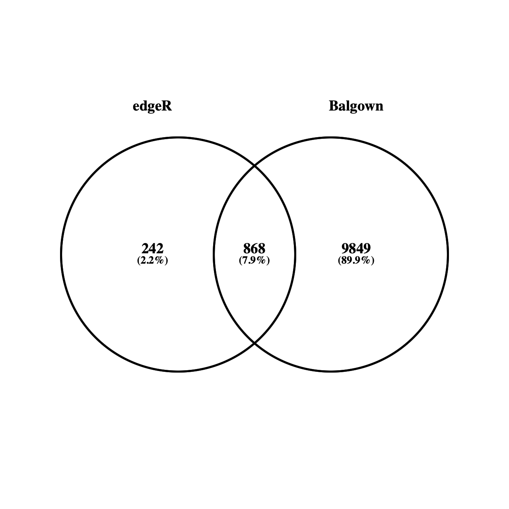

## Kallisto

```bash
cd $REFS_DIR
wget http://ftp.ensembl.org/pub/release-102/fasta/mus_musculus/dna/Mus_musculus.GRCm38.dna.primary_assembly.fa.gz
gtf_to_fasta $REF_GTF  Mus_musculus.GRCm39.cdna.all.fa MUs_musculus_transcripts.fa

gtf_to_fasta $REF_GTF $REF_FASTA transcripts.fa
```

```bash
cd $REFS_DIR
cat transcripts.fa | perl -ne 'if ($_ =~/^\>\d+\s+\w+\s+(ERCC\S+)[\+\-]/){print ">$1\n"}elsif($_ =~ /\d+\s+(ENSMUST\d+)/){print ">$1\n"}else{print $_}' > transcripts.clean.fa
**wc -l transcripts*.fa**
4251706 transcripts.clean.fa
4251706 transcripts.fa
8503412 total
```

```bash
cd $REFS_DIR
#| cut -d\  -f 2 
cat transcripts.clean.fa | grep ">" | perl -ne '$_ =~ s/\>//; print $_' | sort | uniq > transcript_id_list.txt 
```

```bash
cd $REFS_DIR
mkdir kallisto
cd kallisto
kallisto index --index=transcripts_kallisto_index ../transcripts.clean.fa

```

```bash
cd $RNA_HOME/expression/$DATA_NAME
mkdir kallisto
cd kallisto

kallisto quant --single -s 20 -l 100 --index=$REFS_DIR/kallisto/transcripts_kallisto_index --output-dir=SLN_Rep1 --threads=4 --plaintext $DATA_DIR/default/SRR12329253.fastq
kallisto quant --single -s 20 -l 100 --index=$REFS_DIR/kallisto/transcripts_kallisto_index --output-dir=SLN_Rep2 --threads=4 --plaintext $DATA_DIR/default/SRR12329254.fastq

kallisto quant --single -s 20 -l 100 --index=$REFS_DIR/kallisto/transcripts_kallisto_index --output-dir=NCT_Rep1 --threads=4 --plaintext $DATA_DIR/default/SRR12329255.fastq
kallisto quant --single -s 20 -l 100 --index=$REFS_DIR/kallisto/transcripts_kallisto_index --output-dir=NCT_Rep2 --threads=4 --plaintext $DATA_DIR/default/SRR12329256.fastq

```

```bash
cd $RNA_HOME/expression/$DATA_NAME/kallisto
paste */abundance.tsv | cut -f 1,2,5,10,15,20,25,30 > transcript_tpms_all_samples.tsv
ls -1 */abundance.tsv | perl -ne 'chomp $_; if ($_ =~ /(\S+)\/abundance\.tsv/){print "\t$1"}' | perl -ne 'print "target_id\tlength$_\n"' > header.tsv
cat header.tsv transcript_tpms_all_samples.tsv | grep -v "tpm" > transcript_tpms_all_samples.tsv2
mv transcript_tpms_all_samples.tsv2 transcript_tpms_all_samples.tsv
rm -f header.tsv

```

```bash

**head transcript_tpms_all_samples.tsv**
target_id       length  NCT_Rep1        NCT_Rep2        SLN_Rep1        SLN_Rep2
ENSMUST00000193812      1070    0.0174639       0       0.187581        0.726504
ENSMUST00000082908      110     0       0       0       0
ENSMUST00000162897      4153    0       0       0.0420088       0.080081
ENSMUST00000159265      2989    0       0       0.0536794       0.0268271
ENSMUST00000070533      3634    0.00959405      0.0253361       0.0215387       0.0489253
ENSMUST00000192857      480     0       0       0.234224        0.301905
ENSMUST00000195335      2819    0       0       0.164043        0.211445
ENSMUST00000192336      2233    0       0       0.18818 0.269508
ENSMUST00000194099      2309    0       0       0.121139        0.13012
**tail transcript_tpms_all_samples.tsv**
ENSMUST00000178705      101     1.61157 0       31.109  0
ENSMUST00000180206      100     0       0       0       0
ENSMUST00000178366      121     0       0       1.7298  0
ENSMUST00000184505      99      0       0       2.74092 7.06589
ENSMUST00000096791      2949    0       0       0.159475        0
ENSMUST00000071277      2848    2.33083e-08     0       0       0.131672
ENSMUST00000179115      2953    0       0       0       0
ENSMUST00000099422      1304    0.00279768      0       0.030121        0.281427
ENSMUST00000178970      2808    0.0112749       0       0       0
ENSMUST00000179436      243     0.942082        1.08844 0.309858        0.399396
```

### Output

### head transcript_tpms_all_samples.tsv

| target_id | length | NCT_Rep1 | NCT_Rep2 | SLN_Rep1 | SLN_Rep2 |
| --- | --- | --- | --- | --- | --- |
| ENSMUST00000193812 | 1070 | 0.0174639 | 0 | 0.187581 | 0.726504 |
| ENSMUST00000082908 | 110 | 0 | 0 | 0 | 0 |
| ENSMUST00000162897 | 4153 | 0 | 0 | 0.0420088 | 0.080081 |
| ENSMUST00000159265 | 2989 | 0 | 0 | 0.0536794 | 0.0268271 |
| ENSMUST00000070533 | 3634 | 0.00959405 | 0.0253361 | 0.0215387 | 0.0489253 |
| ENSMUST00000192857 | 480 | 0 | 0 | 0.234224 | 0.301905 |
| ENSMUST00000195335 | 2819 | 0 | 0 | 0.164043 | 0.211445 |
| ENSMUST00000192336 | 2233 | 0 | 0 | 0.18818 | 0.269508 |
| ENSMUST00000194099 | 2309 | 0 | 0 | 0.121139 | 0.13012 |

### tail transcript_tpms_all_samples.tsv

| ENSMUST00000178705 | 101 | 1.61157 | 0 | 31.109 | 0 |
| --- | --- | --- | --- | --- | --- |
| ENSMUST00000180206 | 100 | 0 | 0 | 0 | 0 |
| ENSMUST00000178366 | 121 | 0 | 0 | 1.7298 | 0 |
| ENSMUST00000184505 | 99 | 0 | 0 | 2.74092 | 7.06589 |
| ENSMUST00000096791 | 2949 | 0 | 0 | 0.159475 | 0 |
| ENSMUST00000071277 | 2848 | 2.33E-08 | 0 | 0 | 0.131672 |
| ENSMUST00000179115 | 2953 | 0 | 0 | 0 | 0 |
| ENSMUST00000099422 | 1304 | 0.00279768 | 0 | 0.030121 | 0.281427 |
| ENSMUST00000178970 | 2808 | 0.0112749 | 0 | 0 | 0 |
| ENSMUST00000179436 | 243 | 0.942082 | 1.08844 | 0.309858 | 0.399396 |

```bash
cd $RNA_HOME/expression/$DATA_NAME/kallisto
wget https://raw.githubusercontent.com/griffithlab/rnaseq_tutorial/master/scripts/kallisto_gene_matrix.pl
chmod +x kallisto_gene_matrix.pl
./kallisto_gene_matrix.pl --gtf_file=$REF_GTF  --kallisto_transcript_matrix_in=transcript_tpms_all_samples.tsv --kallisto_transcript_matrix_out=gene_tpms_all_samples.tsv
```

[Tutorial_comparisons.R](data/Tutorial_comparisons.r)

```bash
cd $RNA_HOME/expression/$DATA_NAME
wget https://raw.githubusercontent.com/griffithlab/rnaseq_tutorial/master/scripts/Tutorial_comparisons.R
chmod +x Tutorial_comparisons.R

```

[Tutorial_comparisons.pdf](data/Tutorial_comparisons.pdf)

### Make custom DB

```bash
cd $REFS_DIR
grep rRNA $REF_GTF > genes_mice_rRNA.gtf 
gtf_to_fasta genes_mice_rRNA.gtf $REF_FASTA mice_rRNA_transcripts.fa
cat mice_rRNA_transcripts.fa | perl -ne 'if ($_ =~/^\>\d+\s+\w+\s+(ERCC\S+)[\+\-]/){print ">$1\n"}elsif($_ =~ /\d+\s+(ENSM\d+)/){print ">$1\n"}else{print $_}' > mice_rRNA_transcripts.clean.fa
cat mice_rRNA_transcripts.clean.fa

cd $REFS_DIR/kallisto
kallisto index --index=mice_rRNA_transcripts_kallisto_index ../mice_rRNA_transcripts.clean.fa

```

```bash
cd $RNA_HOME/de/$DATA_NAME
mkdir -p sleuth/input
mkdir -p sleuth/results
cd sleuth/input
kallisto quant -b 100 --index=$REFS_DIR/kallisto/mice_rRNA_transcripts_kallisto_index --output-dir=SLN_Rep1 --threads=4  $DATA_DIR/default/SRR12329253.fastq
kallisto quant -b 100 --index=$REFS_DIR/kallisto/mice_rRNA_transcripts_kallisto_index --output-dir=SLN_Rep2 --threads=4 $DATA_DIR/default/SRR12329254.fastq

kallisto quant -b 100 --index=$REFS_DIR/kallisto/mice_rRNA_transcripts_kallisto_index --output-dir=NCT_Rep1 --threads=4 $DATA_DIR/default/SRR12329255.fastq
kallisto quant -b 100 --index=$REFS_DIR/kallisto/mice_rRNA_transcripts_kallisto_index --output-dir=NCT_Rep2 --threads=4 $DATA_DIR/default/SRR12329256.fastq

```

## Sleuth

```bash
cd $RNA_HOME/de/$DATA_NAME
mkdir -p sleuth/input
mkdir -p sleuth/results
cd sleuth/input
kallisto quant -b 100 --single -s 20 -l 100 --index=$REFS_DIR/kallisto/mice_transcripts_kallisto_index --output-dir=SLN_Rep1 --threads=4 $DATA_DIR/default/SRR12329253.fastq
kallisto quant -b 100 --single -s 20 -l 100 --index=$REFS_DIR/kallisto/mice_transcripts_kallisto_index --output-dir=SLN_Rep2 --threads=4 $DATA_DIR/default/SRR12329254.fastq

kallisto quant -b 100 --single -s 20 -l 100 --index=$REFS_DIR/kallisto/mice_transcripts_kallisto_index --output-dir=NCT_Rep1 --threads=4 $DATA_DIR/default/SRR12329255.fastq
kallisto quant -b 100 --single -s 20 -l 100 --index=$REFS_DIR/kallisto/mice_transcripts_kallisto_index --output-dir=NCT_Rep2 --threads=4 $DATA_DIR/default/SRR12329256.fastq
```

```bash
wget https://raw.githubusercontent.com/griffithlab/rnaseq_tutorial/master/scripts/Tutorial_KallistoSleuth.R
chmod +x Tutorial_KallistoSleuth.R
Rscript -e "remotes::install_github("pachterlab/sleuth#260")"
```

[SleuthResults.pdf](data/SleuthResults%201.pdf)

[Tutorial_comparisons.pdf](data/Tutorial_comparisons%201.pdf)

[myanno.mm10_multianno.tsv](data/myanno.mm10_multianno.tsv)

## **Reference Guided Transcript Assembly**

### **Running Stringtie in Reference Guided Mode**

```bash
cd $RNA_HOME/
mkdir -p expression/$DATA_NAME/stringtie/ref_guided/
cd expression/$DATA_NAME/stringtie/ref_guided/

stringtie -p 8 -G $REF_GTF -l NCT_Rep1 -o NCT_Rep1/transcripts.gtf $ALIGN_DIR/NCT_Rep1.bam
stringtie -p 8 -G $REF_GTF -l NCT_Rep2 -o NCT_Rep2/transcripts.gtf $ALIGN_DIR/NCT_Rep2.bam

stringtie -p 8 -G $REF_GTF -l SLN_Rep1 -o SLN_Rep1/transcripts.gtf $ALIGN_DIR/SLN_Rep1.bam
stringtie -p 8 -G $REF_GTF -l SLN_Rep2 -o SLN_Rep2/transcripts.gtf $ALIGN_DIR/SLN_Rep2.bam

```

### **Stringtie De Novo Mode**

```bash
cd $RNA_HOME/
mkdir -p expression/$DATA_NAME/stringtie/de_novo/
cd expression/$DATA_NAME/stringtie/de_novo/

stringtie -p 8 -l NCT_Rep1 -o NCT_Rep1/transcripts.gtf $ALIGN_DIR/NCT_Rep1.bam
stringtie -p 8 -l NCT_Rep2 -o NCT_Rep2/transcripts.gtf $ALIGN_DIR/NCT_Rep2.bam

stringtie -p 8 -l SLN_Rep1 -o SLN_Rep1/transcripts.gtf $ALIGN_DIR/SLN_Rep1.bam
stringtie -p 8 -l SLN_Rep2 -o SLN_Rep2/transcripts.gtf $ALIGN_DIR/SLN_Rep2.bam

```

### Stringtie Merge

```bash
cd $RNA_HOME/expression/$DATA_NAME/stringtie/ref_guided/
ls -1 *Rep*/transcripts.gtf > assembly_GTF_list.txt
cat assembly_GTF_list.txt
stringtie --merge -p 8 -o stringtie_merged.gtf -G $REF_GTF assembly_GTF_list.txt

```

```bash
**awk '{if($3=="transcript") print}' stringtie_merged.gtf | cut -f 1,4,9 | less
# HEAD ONLY**
1	3999557	gene_id	MSTRG.1;	transcript_id	ENSMUST00000208660;	gene_name	Rp1;	ref_gene_id	ENSMUSG00000025900;
1	4290846	gene_id	MSTRG.1;	transcript_id	ENSMUST00000208793;	gene_name	Rp1;	ref_gene_id	ENSMUSG00000025900;
1	4292981	gene_id	MSTRG.1;	transcript_id	ENSMUST00000194992;	gene_name	Rp1;	ref_gene_id	ENSMUSG00000025900;
1	4344146	gene_id	MSTRG.1;	transcript_id	ENSMUST00000027032;	gene_name	Rp1;	ref_gene_id	ENSMUSG00000025900;
1	4148611	gene_id	MSTRG.2;	transcript_id	MSTRG.2.1;				
1	4228497	gene_id	MSTRG.3;	transcript_id	MSTRG.3.1;				
1	4256234	gene_id	MSTRG.4;	transcript_id	ENSMUST00000195384;	gene_name	Gm6101;	ref_gene_id	ENSMUSG00000102948;
1	4363346	gene_id	MSTRG.5;	transcript_id	ENSMUST00000194382;	gene_name	Gm37483;	ref_gene_id	ENSMUSG00000104123;
1	6206197	gene_id	MSTRG.6;	transcript_id	ENSMUST00000159906;	gene_name	Rb1cc1;	ref_gene_id	ENSMUSG00000025907;
1	6206227	gene_id	MSTRG.6;	transcript_id	ENSMUST00000160871;	gene_name	Rb1cc1;	ref_gene_id	ENSMUSG00000025907;
```

```bash
gffcompare -r $REF_GTF -o gffcompare stringtie_merged.gtf
cat gffcompare.stats

#= Summary for dataset: stringtie_merged.gtf 
#     Query mRNAs :  158626 in   67190 loci  (130471 multi-exon transcripts)
#            (21286 multi-transcript loci, ~2.4 transcripts per locus)
# Reference mRNAs :  141745 in   53523 loci  (114891 multi-exon)
# Super-loci w/ reference transcripts:    47926
#-----------------| Sensitivity | Precision  |
        Base level:   100.0     |    95.6    |
        Exon level:    95.7     |    89.6    |
      Intron level:    99.5     |    90.2    |
Intron chain level:   100.0     |    88.1    |
  Transcript level:    99.6     |    89.0    |
       Locus level:    99.8     |    79.4    |

     Matching intron chains:  114891
       Matching transcripts:  141164
              Matching loci:   53392

          Missed exons:       0/446559  (  0.0%)
           Novel exons:   42941/467211  (  9.2%)
        Missed introns:    1342/284916  (  0.5%)
         Novel introns:   26493/314114  (  8.4%)
           Missed loci:       0/53523   (  0.0%)
            Novel loci:   12085/67190   ( 18.0%)
```

```bash
**awk '{if($3=="transcript") print}' gffcompare.annotated.gtf | cut -f 1,4,9 | less
# HEAD ONLY**
1       3073253 transcript_id "ENSMUST00000193812"; gene_id "ENSMUSG00000102693"; gene_name "4933401J01Rik"; xloc "XLOC_000001"; ref_gene_id "ENSMUSG00000102693"; cmp_ref "ENSMUST00000193812"; class_code "="; tss_id "TSS1";
1       3102016 transcript_id "ENSMUST00000082908"; gene_id "ENSMUSG00000064842"; gene_name "Gm26206"; xloc "XLOC_000002"; ref_gene_id "ENSMUSG00000064842"; cmp_ref "ENSMUST00000082908"; class_code "="; tss_id "TSS2";
1       3252757 transcript_id "ENSMUST00000192857"; gene_id "ENSMUSG00000102851"; gene_name "Gm18956"; xloc "XLOC_000003"; ref_gene_id "ENSMUSG00000102851"; cmp_ref "ENSMUST00000192857"; class_code "="; tss_id "TSS3";
1       3466587 transcript_id "ENSMUST00000161581"; gene_id "ENSMUSG00000089699"; gene_name "Gm1992"; xloc "XLOC_000004"; ref_gene_id "ENSMUSG00000089699"; cmp_ref "ENSMUST00000161581"; class_code "="; tss_id "TSS4";
1       3531795 transcript_id "ENSMUST00000192183"; gene_id "ENSMUSG00000103147"; gene_name "Gm7341"; xloc "XLOC_000005"; ref_gene_id "ENSMUSG00000103147"; cmp_ref "ENSMUST00000192183"; class_code "="; tss_id "TSS5";
1       3680155 transcript_id "ENSMUST00000193244"; gene_id "ENSMUSG00000102348"; gene_name "Gm10568"; xloc "XLOC_000006"; ref_gene_id "ENSMUSG00000102348"; cmp_ref "ENSMUST00000193244"; class_code "="; tss_id "TSS6";
1       3752010 transcript_id "ENSMUST00000194454"; gene_id "ENSMUSG00000102592"; gene_name "Gm38385"; xloc "XLOC_000007"; ref_gene_id "ENSMUSG00000102592"; cmp_ref "ENSMUST00000194454"; class_code "="; tss_id "TSS7";
1       4148611 transcript_id "MSTRG.2.1"; gene_id "MSTRG.2"; gene_name "Rp1"; xloc "XLOC_000008"; cmp_ref "ENSMUST00000208660"; class_code "s"; tss_id "TSS8";
1       4228497 transcript_id "MSTRG.3.1"; gene_id "MSTRG.3"; gene_name "Rp1"; xloc "XLOC_000009"; cmp_ref "ENSMUST00000208660"; class_code "s"; tss_id "TSS9";
1       4496551 transcript_id "ENSMUST00000193450"; gene_id "ENSMUSG00000104238"; gene_name "Gm37587"; xloc "XLOC_000010"; ref_gene_id "ENSMUSG00000104238"; cmp_ref "ENSMUST00000193450"; class_code "="; tss_id "TSS10";
```

```bash
cd $RNA_HOME/expression/$DATA_NAME/stringtie/de_novo/
ls -1 *Rep*/transcripts.gtf > assembly_GTF_list.txt
cat assembly_GTF_list.txt
stringtie --merge -p 8 -o stringtie_merged.gtf assembly_GTF_list.txt
```

```bash
**gffcompare -r $REF_GTF -o gffcompare stringtie_merged.gtf
cat gffcompare.stats**

#= Summary for dataset: stringtie_merged.gtf 
#     Query mRNAs :   27022 in   25604 loci  (25412 multi-exon transcripts)
#            (1113 multi-transcript loci, ~1.1 transcripts per locus)
# Reference mRNAs :  141745 in   53523 loci  (114891 multi-exon)
# Super-loci w/ reference transcripts:     6886
#-----------------| Sensitivity | Precision  |
        Base level:     2.8     |    35.8    |
        Exon level:     3.7     |    19.9    |
      Intron level:     7.3     |    40.0    |
Intron chain level:     0.4     |     2.0    |
  Transcript level:     0.4     |     1.9    |
       Locus level:     0.9     |     2.0    |

     Matching intron chains:     509
       Matching transcripts:     519
              Matching loci:     498

          Missed exons:  395992/446559  ( 88.7%)
           Novel exons:   45861/78141   ( 58.7%)
        Missed introns:  253853/284916  ( 89.1%)
         Novel introns:   28191/51812   ( 54.4%)
           Missed loci:   45848/53523   ( 85.7%)
            Novel loci:   13041/25604   ( 50.9%)
```

### **Differential (Expression) Splicing**

```bash
cd $RNA_HOME/expression/$DATA_NAME/stringtie/
mkdir ref_guided_merged
cd ref_guided_merged

stringtie -p 8 -G ../ref_guided/stringtie_merged.gtf -e -B -o NCT_Rep1/transcripts.gtf $ALIGN_DIR/NCT_Rep1.bam
stringtie -p 8 -G ../ref_guided/stringtie_merged.gtf -e -B -o NCT_Rep2/transcripts.gtf $ALIGN_DIR/NCT_Rep2.bam

stringtie -p 8 -G ../ref_guided/stringtie_merged.gtf -e -B -o SLN_Rep1/transcripts.gtf $ALIGN_DIR/SLN_Rep1.bam
stringtie -p 8 -G ../ref_guided/stringtie_merged.gtf -e -B -o SLN_Rep2/transcripts.gtf $ALIGN_DIR/SLN_Rep2.bam

```

```bash
mkdir -p $RNA_HOME/de/$DATA_NAME/ballgown/ref_guided_merged/
cd $RNA_HOME/de/$DATA_NAME/ballgown/ref_guided_merged/

printf "\"ids\",\"type\",\"path\"\n\"SLN_Rep1\",\"SLN\",\"$RNA_HOME/expression/$DATA_NAME/stringtie/ref_guided_merged/SLN_Rep1\"\n\"SLN_Rep2\",\"SLN\",\"$RNA_HOME/expression/$DATA_NAME/stringtie/ref_guided_merged/SLN_Rep2\"\n\"NCT_Rep1\",\"NCT\",\"$RNA_HOME/expression/$DATA_NAME/stringtie/ref_guided_merged/NCT_Rep1\"\n\"NCT_Rep2\",\"NCT\",\"$RNA_HOME/expression/$DATA_NAME/stringtie/ref_guided_merged/NCT_Rep2\"\n" > SLN_vs_NCT.csv

```

```bash
cd $RNA_HOME/expression/$DATA_NAME/stringtie/de_novo
cd $RNA_HOME/expression/$DATA_NAME/stringtie/
mkdir de_novo_merged
cd de_novo_merged

stringtie -p 8 -G ../de_novo/stringtie_merged.gtf -e -B -o NCT_Rep1/transcripts.gtf $ALIGN_DIR/NCT_Rep1.bam
stringtie -p 8 -G ../de_novo/stringtie_merged.gtf -e -B -o NCT_Rep2/transcripts.gtf $ALIGN_DIR/NCT_Rep2.bam
stringtie -p 8 -G ../de_novo/stringtie_merged.gtf -e -B -o SLN_Rep1/transcripts.gtf $ALIGN_DIR/SLN_Rep1.bam
stringtie -p 8 -G ../de_novo/stringtie_merged.gtf -e -B -o SLN_Rep2/transcripts.gtf $ALIGN_DIR/SLN_Rep2.bam

```

```bash
mkdir -p $RNA_HOME/de/$DATA_NAME/ballgown/de_novo_merged/
cd $RNA_HOME/de/$DATA_NAME/ballgown/de_novo_merged/

printf "\"ids\",\"type\",\"path\"\n\"SLN_Rep1\",\"SLN\",\"$RNA_HOME/expression/$DATA_NAME/stringtie/de_novo_merged/SLN_Rep1\"\n\"SLN_Rep2\",\"SLN\",\"$RNA_HOME/expression/$DATA_NAME/stringtie/de_novo_merged/SLN_Rep2\"\n\"NCT_Rep1\",\"NCT\",\"$RNA_HOME/expression/$DATA_NAME/stringtie/de_novo_merged/NCT_Rep1\"\n\"NCT_Rep2\",\"NCT\",\"$RNA_HOME/expression/$DATA_NAME/stringtie/de_novo_merged/NCT_Rep2\"\n" > SLN_vs_NCT.csv

```

### Splicing Visualization

### **Visualizing Results at the Command Line**

```bash
**cd $RNA_HOME/expression/$DATA_NAME/stringtie/de_novo/
head stringtie_merged.gtf**
# stringtie --merge -p 8 -o stringtie_merged.gtf assembly_GTF_list.txt
# StringTie version 2.1.1
1       StringTie       transcript      4228497 4231149 1000    +       .       gene_id "MSTRG.1"; transcript_id "MSTRG.1.1"; 
1       StringTie       exon    4228497 4228619 1000    +       .       gene_id "MSTRG.1"; transcript_id "MSTRG.1.1"; exon_number "1"; 
1       StringTie       exon    4231053 4231149 1000    +       .       gene_id "MSTRG.1"; transcript_id "MSTRG.1.1"; exon_number "2"; 
1       StringTie       transcript      4206780 4226796 1000    +       .       gene_id "MSTRG.2"; transcript_id "MSTRG.2.1"; 
1       StringTie       exon    4206780 4206837 1000    +       .       gene_id "MSTRG.2"; transcript_id "MSTRG.2.1"; exon_number "1"; 
1       StringTie       exon    4226611 4226796 1000    +       .       gene_id "MSTRG.2"; transcript_id "MSTRG.2.1"; exon_number "2"; 
1       StringTie       transcript      4147812 4148680 1000    -       .       gene_id "MSTRG.3"; transcript_id "MSTRG.3.1"; 
1       StringTie       exon    4147812 4147963 1000    -       .       gene_id "MSTRG.3"; transcript_id "MSTRG.3.1"; exon_number "1";
```

```bash
**cd $RNA_HOME/expression/stringtie/de_novo/
cat stringtie_merged.gtf | perl -ne 'if ($_ =~ /gene_id\s+\"(\S+)\"\;/){print "$1\n"}' | sort | uniq | wc -l**

25585
```

```bash
**head gffcompare.stringtie_merged.gtf.tmap**
ref_gene_id     ref_id  class_code      qry_gene_id     qry_id  num_exons       FPKM    TPM             cov     len     major_iso_id    ref_match_len
Rp1     ENSMUST00000208660      s       MSTRG.1 MSTRG.1.1       2       0.000000        0.000000        0.000000        220     MSTRG.1.1       4170
Rp1     ENSMUST00000208660      s       MSTRG.2 MSTRG.2.1       2       0.000000        0.000000        0.000000        244     MSTRG.2.1       4170
Rp1     ENSMUST00000208660      c       MSTRG.3 MSTRG.3.1       2       0.000000        0.000000        0.000000        221     MSTRG.3.1       4170
Rp1     ENSMUST00000208660      s       MSTRG.4 MSTRG.4.1       4       0.000000        0.000000        0.000000        525     MSTRG.4.1       4170
Tcea1   ENSMUST00000081551      s       MSTRG.5 MSTRG.5.1       3       0.000000        0.000000        0.000000        292     MSTRG.5.1       2547
Lypla1  ENSMUST00000027036      s       MSTRG.6 MSTRG.6.1       9       0.000000        0.000000        0.000000        841     MSTRG.6.1       2507
Lypla1  ENSMUST00000134384      s       MSTRG.6 MSTRG.6.2       4       0.000000        0.000000        0.000000        392     MSTRG.6.1       1136
Tcea1   ENSMUST00000081551      s       MSTRG.6 MSTRG.6.3       3       0.000000        0.000000        0.000000        280     MSTRG.6.1       2547
Lypla1  ENSMUST00000134384      c       MSTRG.7 MSTRG.7.1       7       0.000000        0.000000        0.000000        470     MSTRG.7.1       1136

**grep "j" gffcompare.stringtie_merged.gtf.tmap | head**
ref_gene_id     ref_id  class_code      qry_gene_id     qry_id  num_exons       FPKM    TPM             cov     len     major_iso_id    ref_match_len
Sntg1   ENSMUST00000140295      j       MSTRG.25        MSTRG.25.2      3       0.000000        0.000000        0.000000        301     MSTRG.25.1      4887
Cspp1   ENSMUST00000071087      j       MSTRG.38        MSTRG.38.1      7       0.000000        0.000000        0.000000        697     MSTRG.38.1      4355
Cspp1   ENSMUST00000071087      j       MSTRG.42        MSTRG.42.1      2       0.000000        0.000000        0.000000        245     MSTRG.42.1      4355
Arfgef1 ENSMUST00000088615      j       MSTRG.43        MSTRG.43.1      3       0.000000        0.000000        0.000000        865     MSTRG.43.1      6978
Terf1   ENSMUST00000188371      j       MSTRG.57        MSTRG.57.1      2       0.000000        0.000000        0.000000        232     MSTRG.57.1      2268
Ncoa2   ENSMUST00000006037      j       MSTRG.59        MSTRG.59.2      3       0.000000        0.000000        0.000000        424     MSTRG.59.2      4897
Rpl7    ENSMUST00000058437      j       MSTRG.65        MSTRG.65.1      4       0.000000        0.000000        0.000000        517     MSTRG.65.1      1163
Pkhd1   ENSMUST00000088448      j       MSTRG.77        MSTRG.77.1      3       0.000000        0.000000        0.000000        236     MSTRG.77.1      12935
Gsta3   ENSMUST00000121676      j       MSTRG.79        MSTRG.79.1      2       0.000000        0.000000        0.000000        329     MSTRG.79.1      894
**grep "j" gffcompare.stringtie_merged.gtf.tmap | cut -f 1 | sort | uniq | wc -l
1877**
```

### Annotate

```bash
samtools merge -f NCT.bam NCT_Rep1.bam NCT_Rep2.bam
samtools merge -f SLN.bam SLN_Rep1.bam SLN_Rep2.bam
parallel  samtools index ::: *.bam
samtools index NCT.bam;samtools index SLN.bam
```

```bash
**cd $RNA_HOME/alignments/hisat2/$DATA_NAME/merged

regtools junctions extract -s 0 NCT.bam > NCT.junctions.bed
head NCT.junctions.bed**
1       3274155 3280222 JUNC00000001    1       +       3274155 3280222 255,0,0 2       80,20   0,6047
1       3770979 3806985 JUNC00000002    1       -       3770979 3806985 255,0,0 2       24,76   0,35930
1       4142758 4147903 JUNC00000003    1       -       4142758 4147903 255,0,0 2       8,92    0,5053
1       4147925 4148673 JUNC00000004    1       +       4147925 4148673 255,0,0 2       38,62   0,686
1       4147930 4148682 JUNC00000005    6       -       4147930 4148682 255,0,0 2       33,71   0,681
1       4148656 4163941 JUNC00000006    3       +       4148656 4163941 255,0,0 2       88,87   0,15198
1       4163854 4170293 JUNC00000007    7       +       4163854 4170293 255,0,0 2       87,89   0,6350
1       4163869 4170232 JUNC00000008    1       -       4163869 4170232 255,0,0 2       72,28   0,6335
1       4170347 4197576 JUNC00000009    1       +       4170347 4197576 255,0,0 2       57,43   0,27186
1       4197576 4206720 JUNC00000010    4       -       4197576 4206720 255,0,0 2       65,61   0,9083
**regtools junctions annotate NCT.junctions.bed $REF_FASTA $REF_GTF > NCT.junctions.anno.bed
head NCT.junctions.anno.bed**
chrom   start   end     name    score   strand  splice_site     acceptors_skipped       exons_skipped   donors_skipped  anchor  known_donor     known_acceptor  known_junction  gene_names      gene_ids        transcripts
1       3274235 3280203 JUNC00000001    1       +       CT-AC   0       0       0       N       0       0       0       NA      NA      NA
1       3771003 3806910 JUNC00000002    1       -       CT-AC   0       0       0       N       0       0       0       NA      NA      NA
1       4142766 4147812 JUNC00000003    1       -       GT-AG   0       0       0       DA      1       1       1       Rp1     ENSMUSG00000025900      ENSMUST00000208660
1       4147963 4148612 JUNC00000004    1       +       CT-AC   0       0       0       N       0       0       0       NA      NA      NA
1       4147963 4148612 JUNC00000005    6       -       GT-AG   0       0       0       DA      1       1       1       Rp1     ENSMUSG00000025900      ENSMUST00000208660
1       4148744 4163855 JUNC00000006    3       +       CT-AC   0       0       0       N       0       0       0       NA      NA      NA
1       4163941 4170205 JUNC00000007    7       +       CT-AC   0       0       0       N       0       0       0       NA      NA      NA
1       4163941 4170205 JUNC00000008    1       -       GT-AG   0       0       0       DA      1       1       1       Rp1     ENSMUSG00000025900      ENSMUST00000208660
1       4170404 4197534 JUNC00000009    1       +       CT-AC   0       0       0       N       0       0       0       NA      NA      NA
**regtools junctions extract -s 0 SLN.bam > SLN.junctions.bed
head SLN.junctions.bed**
1       3043663 3124186 JUNC00000001    2       -       3043663 3124186 255,0,0 2       80,20   0,80503
1       3417149 3417352 JUNC00000002    2       +       3417149 3417352 255,0,0 2       28,68   0,135
1       3654899 3655703 JUNC00000003    4       +       3654899 3655703 255,0,0 2       23,83   0,721
1       3654900 3655703 JUNC00000004    4       +       3654900 3655703 255,0,0 2       23,83   0,720
1       3654901 3655703 JUNC00000005    4       +       3654901 3655703 255,0,0 2       23,83   0,719
1       3873326 3879564 JUNC00000006    2       -       3873326 3879564 255,0,0 2       73,27   0,6211
1       4012309 4021275 JUNC00000007    2       +       4012309 4021275 255,0,0 2       20,80   0,8886
1       4080018 4106856 JUNC00000008    2       -       4080018 4106856 255,0,0 2       24,76   0,26762
1       4147930 4148680 JUNC00000010    24      -       4147930 4148680 255,0,0 2       33,69   0,681
1       4148688 4163941 JUNC00000011    6       +       4148688 4163941 255,0,0 2       56,87   0,15166
**regtools junctions annotate SLN.junctions.bed $REF_FASTA $REF_GTF > SLN.junctions.anno.bed
head SLN.junctions.anno.bed**
chrom   start   end     name    score   strand  splice_site     acceptors_skipped       exons_skipped   donors_skipped  anchor  known_donor     known_acceptor  known_junction  gene_names      gene_ids        transcripts
1       3043743 3124167 JUNC00000001    2       -       CT-AC   0       0       0       N       0       0       0       NA      NA      NA
1       3417177 3417285 JUNC00000002    2       +       GT-AG   0       0       0       N       0       0       0       NA      NA      NA
1       3654922 3655621 JUNC00000003    4       +       AA-CT   0       0       0       N       0       0       0       NA      NA      NA
1       3654923 3655621 JUNC00000004    4       +       AA-CT   0       0       0       N       0       0       0       NA      NA      NA
1       3654924 3655621 JUNC00000005    4       +       AG-CT   0       0       0       N       0       0       0       NA      NA      NA
1       3873399 3879538 JUNC00000006    2       -       CT-AC   0       0       0       N       0       0       0       NA      NA      NA
1       4012329 4021196 JUNC00000007    2       +       CT-AC   0       0       0       N       0       0       0       NA      NA      NA
1       4080042 4106781 JUNC00000008    2       -       CT-AC   1       1       1       N       0       0       0       NA      NA      NA
1       4147963 4148612 JUNC00000010    24      -       GT-AG   0       0       0       DA      1       1       1       Rp1     ENSMUSG00000025900      ENSMUST00000208660
```

```bash
**grep -P -w "NDA|A|D" NCT.junctions.anno.bed | perl -ne 'chomp; @l=split("\t",$_); if ($l[4] > 3){print "$_\n"}' | head**
1       13224713        13225267        JUNC00000335    4       -       GT-AG   0       0       0       A       0       1       0       Ncoa2   ENSMUSG00000005886      ENSMUST00000006037,ENSMUST00000068304,ENSMUST00000081713,ENSMUST00000124088,ENSMUST00000139970,ENSMUST00000143603,ENSMUST00000145280,ENSMUST00000147927
1       70298763        70299583        JUNC00002750    10      +       GT-AG   0       0       0       A       0       1       0       Spag16  ENSMUSG00000053153      ENSMUST00000065425,ENSMUST00000161310
1       79722268        79724645        JUNC00003409    143     -       GT-AG   1       0       0       NDA     1       1       0       Wdfy1   ENSMUSG00000073643      ENSMUST00000113511,ENSMUST00000113512,ENSMUST00000113513,ENSMUST00000113514,ENSMUST00000113515,ENSMUST00000130714,ENSMUST00000187005
1       171868508       171872697       JUNC00007738    4       +       GT-AG   0       0       0       A       0       1       0       Cd84    ENSMUSG00000038147      ENSMUST00000042302,ENSMUST00000128189,ENSMUST00000136479,ENSMUST00000155802
1       177131096       177209976       JUNC00008199    4       -       GT-AG   0       0       0       A       0       1       0       Akt3    ENSMUSG00000019699      ENSMUST00000019843,ENSMUST00000111159,ENSMUST00000111160
1       177210037       177248676       JUNC00008201    8       -       GT-AG   0       0       0       D       1       0       0       Akt3    ENSMUSG00000019699      ENSMUST00000019843,ENSMUST00000111159,ENSMUST00000111160
10      76399986        76400786        JUNC00011910    5       +       GT-AG   0       0       0       A       0       1       0       1700094J05Rik   ENSMUSG00000101695      ENSMUST00000190491
10      83628833        83629678        JUNC00013416    4       -       GT-AG   0       0       0       A       0       1       0       Appl2   ENSMUSG00000020263      ENSMUST00000020500,ENSMUST00000133719,ENSMUST00000146876,ENSMUST00000147582,ENSMUST00000150685
10      120843467       120849976       JUNC00014943    8       -       GT-AG   0       0       0       D       1       0       0       Msrb3   ENSMUSG00000051236      ENSMUST00000092143,ENSMUST00000130950,ENSMUST00000139961
10      120843528       120849976       JUNC00014945    12      -       GT-AG   0       0       0       D       1       0       0       Msrb3   ENSMUSG00000051236      ENSMUST00000092143,ENSMUST00000130950,ENSMUST00000139961

**grep -P -w "NDA|A|D" SLN.junctions.anno.bed | perl -ne 'chomp; @l=split("\t",$_); if ($l[4] > 3){print "$_\n"}' | head**
1       13224713        13225267        JUNC00000196    8       -       GT-AG   0       0       0       A       0       1       0       Ncoa2   ENSMUSG00000005886      ENSMUST00000006037,ENSMUST00000068304,ENSMUST00000081713,ENSMUST00000124088,ENSMUST00000139970,ENSMUST00000143603,ENSMUST00000145280,ENSMUST00000147927
1       46116294        46467251        JUNC00000810    4       +       GT-AG   62      60      65      NDA     1       1       0       Dnah7b,Dnah7c   ENSMUSG00000041144,ENSMUSG00000101337   ENSMUST00000069293,ENSMUST00000189749,ENSMUST00000238212,ENSMUST00000238593
1       60006319        60007687        JUNC00001179    4       -       GT-AG   0       0       0       A       0       1       0       Ica1l   ENSMUSG00000026018      ENSMUST00000027172,ENSMUST00000189776,ENSMUST00000191251
1       62980516        62981198        JUNC00001230    4       -       GT-AG   0       0       0       D       1       0       0       Ino80d  ENSMUSG00000040865      ENSMUST00000133236
1       65363315        65369388        JUNC00001281    4       +       GT-AG   0       0       0       D       1       0       0       Pth2r   ENSMUSG00000025946      ENSMUST00000027083
1       79722268        79724645        JUNC00001590    230     -       GT-AG   1       0       0       NDA     1       1       0       Wdfy1   ENSMUSG00000073643      ENSMUST00000113511,ENSMUST00000113512,ENSMUST00000113513,ENSMUST00000113514,ENSMUST00000113515,ENSMUST00000130714,ENSMUST00000187005
1       86546782        86554221        JUNC00001832    4       -       GT-AG   1       2       2       A       0       1       0       Pde6d   ENSMUSG00000026239      ENSMUST00000027444,ENSMUST00000143674,ENSMUST00000146220,ENSMUST00000148683,ENSMUST00000150653
1       136152415       136152755       JUNC00002831    4       +       GT-AG   0       0       0       D       1       0       0       Kif21b  ENSMUSG00000041642      ENSMUST00000075164,ENSMUST00000130864
1       157295194       157299137       JUNC00003325    4       -       GT-AG   0       0       0       D       1       0       0       Rasal2  ENSMUSG00000070565      ENSMUST00000078308,ENSMUST00000132699,ENSMUST00000143080
1       177131096       177209976       JUNC00003866    4       -       GT-AG   0       0       0       A       0       1       0       Akt3    ENSMUSG00000019699      ENSMUST00000019843,ENSMUST00000111159,ENSMUST00000111160
```

```bash
cd $RNA_HOME/student_tools
wget https://raw.githubusercontent.com/griffithlab/rnaseq_tutorial/master/scripts/stringtie_filter_gtf.pl
chmod +x stringtie_filter_gtf.pl 

cd $RNA_HOME/expression/$DATA_NAME/stringtie/ref_only/
$RNA_HOME/student_tools/stringtie_filter_gtf.pl --expression_metric=FPKM --result_dirs='NCT_Rep1,NCT_Rep2,SLN_Rep1,SLN_Rep2' --input_gtf_file='$REF_GTF' --filtered_gtf_file='$RNA_HOME/expression/$DATA_NAME/stringtie/ref_only/Mus_musculus38.filtered.gtf' --exp_cutoff=0 --min_sample_count=2

cd $RNA_HOME/expression/$DATA_NAME/stringtie/ref_guided_merged/
$RNA_HOME/student_tools/stringtie_filter_gtf.pl --expression_metric=FPKM --result_dirs='NCT_Rep1,NCT_Rep2,SLN_Rep1,SLN_Rep2' --input_gtf_file='/home/furkankykc/workspace/rnaseq/expression/mice/stringtie/ref_guided/stringtie_merged.gtf' --filtered_gtf_file='$RNA_HOME/rnaseq/expression/$DATA_NAME/stringtie/ref_guided/stringtie_merged.filtered.gtf' --exp_cutoff=0 --min_sample_count=2
```

```bash
cd $RNA_HOME/expression/$DATA_NAME/stringtie
mkdir visualization
cd visualization
cat $REF_GTF | perl -ne 'chomp; @l=split("\t", $_); print "$_\n" unless ($l[2] eq "gene");' > Mus38_reference.gtf
cp $RNA_HOME/expression/$DATA_NAME/stringtie/ref_only/Mus_musculus38.filtered.gtf ref_only.gtf
cp $RNA_HOME/expression/$DATA_NAME/stringtie/ref_guided/stringtie_merged.filtered.gtf ref_guided.gtf
cp $RNA_HOME/expression/$DATA_NAME/stringtie/de_novo/stringtie_merged.gtf de_novo.gtf

```

## Variation Analysis

### Installation

```bash
mkdir $RNA_HOME/var/$DATA_NAME -p
```

```bash
cd $RNA_HOME/student_tools
git clone https://github.com/davidliwei/rnaseqmut/
cp $RNA_HOME/student_tools/rnaseqmut/bin/rnaseqmut.linux.x64 $RNA_HOME/student_tools/rnaseqmut/bin/rnaseqmut
cd rnaseqmut/demo/data
rm *.ba?
```

### variation.pipeline

```bash
#check out the sam files
for i in $(ls $ALIGN_DIR/*.sam )
do
echo item:$i
done
```

```bash
#check out the sam file headers
for i in $(ls $ALIGN_DIR/*_*.sam  | tr -s '/.' ' ' | awk '{print $(NF-1)}')
do
echo item:$i
done

```

```bash
#create bam files from the sam files and index to create the bai files
for i in $(ls $ALIGN_DIR/*_*.sam  | tr -s '/.' ' ' | awk '{print $(NF-1)}')
do
samtools sort $RNA_HOME/alignments/hisat2/$i.sam > $i.bam
samtools index $i.bam
echo indexing of $i finished
done

```

```bash

#modify rnaseqmut shell script with our own normal and cancer brain file names
#modify depth from 10 to 5
nano $RNA_HOME/student_tools/rnaseqmut/demo/rundemo.sh
cd $RNA_HOME/student_tools/
#run rnaseqmut on the bam files and produce the filtered snps (vcf files)
cd rnaseqmut/demo
./rundemo.sh

#take a look at the found variations
nano $DATA_NAME/results/ALLMUT_FILTERED.vcf
```

```bash
#annotate your vcf using Annovar
grep -n chrom $DATA_NAME/results/ALLMUT_FILTERED.vcf
wc -l $DATA_NAME/results/ALLMUT_FILTERED.vcf
# tail -n the number of lines after #chrom  or grep -v '#' ALLMUT_FILTERED.vcf
awk '{FS="\t";n=split($0,array,"\t"); if(n==7) print $1"\t"$2"\t"$3"\t"$4"\t"$5"\t"$6"\t.\t"$7}' $RNA_HOME/student_tools/rnaseqmut/demo/$DATA_NAME/results/ALLMUT_FILTERED.vcf > $RNA_HOME/student_tools/rnaseqmut/demo/$DATA_NAME/results/ALLMUT_FILTERED.filtercoladded.vcf
```

```bash
#for annovar, first download a few annotation databases
cd $RNA_HOME/student_tools/annovar

perl annotate_variation.pl -buildver mm10 -downdb -webfrom annovar refGene mousedb/

perl annotate_variation.pl -buildver mm10 -downdb cytoBand mousedb/

perl annotate_variation.pl -buildver mm10 -downdb genomicSuperDups mousedb/

perl annotate_variation.pl -buildver mm10 -downdb -webfrom ucsc snp142 mousedb/

perl annotate_variation.pl -buildver mm10 -downdb -webfrom ucsc snp137 mousedb/

perl annotate_variation.pl -buildver mm10 -downdb -webfrom ucsc snp142CodingDbSnp mousedb/

perl annotate_variation.pl -buildver mm10 -downdb -webfrom ucsc snp137CodingDbSnp mousedb/

```

```bash
mkdir $RNA_HOME/student_tools/annovar/$DATA_NAME -p
cd $RNA_HOME/student_tools/annovar
#run annovar on the 6 variants we found to check if they exist in any of the databases
perl table_annovar.pl $RNA_HOME/student_tools/rnaseqmut/demo/$DATA_NAME/results/ALLMUT_FILTERED.filtercoladded.vcf mousedb/ -buildver mm10 -out $DATA_NAME/myanno -remove -protocol refGene,cytoBand -operation g,r -nastring . -vcfinput
cp $DATA_NAME/myanno.mm10_multianno.txt $DATA_NAME/myanno.mm10_multianno.tsv
less -S $DATA_NAME/myanno.mm10_multianno.tsv

```

```bash
**less -S $DATA_NAME/myanno.mm10_multianno.tsv | head**
Chr     Start   End     Ref     Alt     Func.refGene    Gene.refGene    GeneDetail.refGene      ExonicFunc.refGene      AAChange.refGene        cytoBand        Otherinfo
10      72297177        72297177        A       T       intergenic      1700049L16Rik;Zwint     dist=316472;dist=357669 .       .       10qB5.3 .       1.0     10      10      72297177        .       A       T       1.0     .       NORMAL1.DP4=10,0,0,0;NORMAL2.DP4=18,0,0,0;NICOTINE1.DP4=76,3,6,0;NICOTINE2.DP4=76,3,6,0;
12      3109884 3109884 G       T       intergenic      NONE;Rab10os    dist=NONE;dist=125907   .       .       12qA1.1 .       1.0     31      12      3109884 .       G       T       1.0     .       NORMAL1.DP4=11,20,0,0;NORMAL2.DP4=24,27,0,0;NICOTINE1.DP4=210,384,1,5;NICOTINE2.DP4=210,384,1,5;
12      3109893 3109893 G       A       intergenic      NONE;Rab10os    dist=NONE;dist=125898   .       .       12qA1.1 .       1.0     64      12      3109893 .       G       A       1.0     .       NORMAL1.DP4=26,38,0,0;NORMAL2.DP4=42,42,0,0;NICOTINE1.DP4=404,586,3,2;NICOTINE2.DP4=404,586,3,2;
12      3109895 3109895 A       T       intergenic      NONE;Rab10os    dist=NONE;dist=125896   .       .       12qA1.1 .       1.0     69      12      3109895 .       A       T       1.0     .       NORMAL1.DP4=27,42,0,0;NORMAL2.DP4=43,43,0,0;NICOTINE1.DP4=435,608,2,4;NICOTINE2.DP4=435,608,2,4;
12      3109899 3109899 C       T       intergenic      NONE;Rab10os    dist=NONE;dist=125892   .       .       12qA1.1 .       1.0     72      12      3109899 .       C       T       1.0     .       NORMAL1.DP4=27,45,0,0;NORMAL2.DP4=45,45,0,0;NICOTINE1.DP4=469,646,2,4;NICOTINE2.DP4=469,646,2,4;
12      3109907 3109907 A       G       intergenic      NONE;Rab10os    dist=NONE;dist=125884   .       .       12qA1.1 .       1.0     97      12      3109907 .       A       G       1.0     .       NORMAL1.DP4=34,63,0,0;NORMAL2.DP4=53,52,0,0;NICOTINE1.DP4=528,708,3,3;NICOTINE2.DP4=528,708,3,3;
12      3109912 3109912 G       A       intergenic      NONE;Rab10os    dist=NONE;dist=125879   .       .       12qA1.1 .       1.0     137     12      3109912 .       G       A       1.0     .       NORMAL1.DP4=56,81,0,0;NORMAL2.DP4=72,67,0,0;NICOTINE1.DP4=685,872,9,5;NICOTINE2.DP4=685,872,9,5;
12      3109921 3109921 G       A       intergenic      NONE;Rab10os    dist=NONE;dist=125870   .       .       12qA1.1 .       1.0     153     12      3109921 .       G       A       1.0     .       NORMAL1.DP4=62,91,0,0;NORMAL2.DP4=80,73,0,0;NICOTINE1.DP4=816,1006,5,0;NICOTINE2.DP4=816,1006,5,0;
12      3109921 3109921 G       T       intergenic      NONE;Rab10os    dist=NONE;dist=125870   .       .       12qA1.1 .       1.0     153     12      3109921 .       G       T       1.0     .       NORMAL1.DP4=62,91,0,0;NORMAL2.DP4=80,73,0,0;NICOTINE1.DP4=816,1006,4,2;NICOTINE2.DP4=816,1006,4,2;

```

## Gene Enrichment

[top_sig_genes.R](data/top_sig_genes%201.r)

[gene_enrichment.R](data/gene_enrichment.r)

```bash
cd $RNA_HOME/de/$DATA_NAME/ballgown/ref_only/enrichment
wget http://eng1.mu.edu.tr/~tugba/SeqAnalysis/c6.all.v7.1.entrez.gmt 
wget http://eng1.mu.edu.tr/~tugba/SeqAnalysis/c7.all.v7.1.entrez.gmt
wget http://ge-lab.org/gskb/2-MousePath/mGSKB_Entrez.gmt

#For mouse data sets, on Linux shell, in R, please use the following enrichment code : 
#!/usr/bin/env Rscript
library(clusterProfiler)
library(GSEABase)
library(org.Mm.eg.db)
top_genes <- read.table(file = 'top20_genes.tsv', sep = '\t', header = TRUE)
head(top_genes)
filename<- "mGSKB_Entrez.gmt"
c6 <- read.gmt(filename)
t <- c(top_genes$gene_name)
et <- bitr(t, fromType="SYMBOL", toType=(c("ENTREZID","GENENAME")), OrgDb="org.Mm.eg.db")
head(et)
yourEntrezIdList<- c(et$ENTREZID) #USE YOUR OWN ENTREZ GENEID LIST HERE
ImmunSigEnrich <- enricher(yourEntrezIdList, TERM2GENE=c6, pvalueCutoff = 0.01)
ImmunSigEnrich <- setReadable(ImmunSigEnrich, OrgDb = org.Mm.eg.db, keyType = "ENTREZID")
write.csv(ImmunSigEnrich,"MyImmunePathwayRelatedGenes.csv")
goEnrich<-enrichGO(gene= yourEntrezIdList,OrgDb= org.Mm.eg.db, ont= "ALL",pAdjustMethod= "BH",pvalueCutoff = 0.01,readable= TRUE)
write.csv(goEnrich,"MyGORelatedGenes.csv")
keggEnrich<-enrichKEGG(gene= yourEntrezIdList,organism= "mmu",pAdjustMethod="BH", pvalueCutoff = 0.01)
write.csv(keggEnrich,"MyKEGGRelatedGenes.csv")
```

## De genes

### Gene Ontology

|  | ONTOLOGY | ID | Description | GeneRatio | BgRatio |
| --- | --- | --- | --- | --- | --- |
| GO:0032331 | BP | GO:0032331 | negative regulation of chondrocyte differentiation | 2/18 | 24/29008 |
| GO:0061037 | BP | GO:0061037 | negative regulation of cartilage development | 2/18 | 31/29008 |
| GO:0048306 | MF | GO:0048306 | calcium-dependent protein binding | 2/17 | 95/28438 |
| GO:0050786 | MF | GO:0050786 | RAGE receptor binding | 1/17 | 10/28438 |
| GO:0098879 | MF | GO:0098879 | structural constituent of postsynaptic specialization | 1/17 | 10/28438 |
| GO:0034511 | MF | GO:0034511 | U3 snoRNA binding | 1/17 | 11/28438 |
| GO:0097677 | MF | GO:0097677 | STAT family protein binding | 1/17 | 11/28438 |
| GO:0044548 | MF | GO:0044548 | S100 protein binding | 1/17 | 14/28438 |
| GO:0047372 | MF | GO:0047372 | acylglycerol lipase activity | 1/17 | 14/28438 |
| GO:0005523 | MF | GO:0005523 | tropomyosin binding | 1/17 | 15/28438 |
| GO:0015556 | MF | GO:0015556 | C4-dicarboxylate transmembrane transporter activity | 1/17 | 15/28438 |
| GO:0030228 | MF | GO:0030228 | lipoprotein particle receptor activity | 1/17 | 16/28438 |
| GO:0015172 | MF | GO:0015172 | acidic amino acid transmembrane transporter activity | 1/17 | 17/28438 |
| GO:0070034 | MF | GO:0070034 | telomerase RNA binding | 1/17 | 17/28438 |
| GO:0030169 | MF | GO:0030169 | low-density lipoprotein particle binding | 1/17 | 20/28438 |
| GO:0099186 | MF | GO:0099186 | structural constituent of postsynapse | 1/17 | 20/28438 |
| GO:0046965 | MF | GO:0046965 | retinoid X receptor binding | 1/17 | 22/28438 |
| GO:0001227 | MF | GO:0001227 | DNA-binding transcription repressor activity, RNA polymerase II-specific | 2/17 | 328/28438 |
| GO:0061629 | MF | GO:0061629 | RNA polymerase II-specific DNA-binding transcription factor binding | 2/17 | 329/28438 |
| GO:0001217 | MF | GO:0001217 | DNA-binding transcription repressor activity | 2/17 | 330/28438 |
| GO:0005310 | MF | GO:0005310 | dicarboxylic acid transmembrane transporter activity | 1/17 | 29/28438 |
| GO:0071813 | MF | GO:0071813 | lipoprotein particle binding | 1/17 | 30/28438 |
| GO:0071814 | MF | GO:0071814 | protein-lipid complex binding | 1/17 | 30/28438 |
| GO:0098918 | MF | GO:0098918 | structural constituent of synapse | 1/17 | 30/28438 |
| GO:0030515 | MF | GO:0030515 | snoRNA binding | 1/17 | 32/28438 |
| GO:0016831 | MF | GO:0016831 | carboxy-lyase activity | 1/17 | 33/28438 |
| GO:0042974 | MF | GO:0042974 | retinoic acid receptor binding | 1/17 | 33/28438 |
| GO:0003729 | MF | GO:0003729 | mRNA binding | 2/17 | 366/28438 |

[MyGORelatedGenes.csv](data/MyGORelatedGenes.csv)

### Immune Pathway

|  | ID | Description | GeneRatio | BgRatio | pvalue | p.adjust |
| --- | --- | --- | --- | --- | --- | --- |
| LIT_MM_OUYANG_FOXO1-DE_CD4_T-CELL_DIFF_Entrez | LIT_MM_OUYANG_FOXO1-DE_CD4_T-CELL_DIFF_Entrez | LIT_MM_OUYANG_FOXO1-DE_CD4_T-CELL_DIFF_Entrez | 4/19 | 232/27982 | 1,62E+09 | 162.133.005.763.331 |
| LIT_MM_TIMMONS_BROWN-PREADIPOCYTE_7D_4D_UNIQUE_DN_Entrez | LIT_MM_TIMMONS_BROWN-PREADIPOCYTE_7D_4D_UNIQUE_DN_Entrez | LIT_MM_TIMMONS_BROWN-PREADIPOCYTE_7D_4D_UNIQUE_DN_Entrez | 4/19 | 238/27982 | 1,79E+09 | 162.133.005.763.331 |
| LIT_MM_PELLEGATTA_GL261-NS_VS_GL261-AC_TUMOR_DN_Entrez | LIT_MM_PELLEGATTA_GL261-NS_VS_GL261-AC_TUMOR_DN_Entrez | LIT_MM_PELLEGATTA_GL261-NS_VS_GL261-AC_TUMOR_DN_Entrez | 4/19 | 278/27982 | 3,29E+09 | 162.133.005.763.331 |
| GO_BP_MM_NEGATIVE_REGULATION_OF_CHONDROCYTE_DIFFERENTIATION_Entrez | GO_BP_MM_NEGATIVE_REGULATION_OF_CHONDROCYTE_DIFFERENTIATION_Entrez | GO_BP_MM_NEGATIVE_REGULATION_OF_CHONDROCYTE_DIFFERENTIATION_Entrez | 2/19 | 13/27982 | 3,39E+09 | 162.133.005.763.331 |
| LIT_MM_TIMMONS_DIFFERENTIATION_WHITE-BROWN-PREADIPOCYTE-OVERLAP_DN_Entrez | LIT_MM_TIMMONS_DIFFERENTIATION_WHITE-BROWN-PREADIPOCYTE-OVERLAP_DN_Entrez | LIT_MM_TIMMONS_DIFFERENTIATION_WHITE-BROWN-PREADIPOCYTE-OVERLAP_DN_Entrez | 3/19 | 108/27982 | 5,18E+09 | 16.505.253.500.348 |
| LIT_MM_TIMMONS_WHITE-BROWN-PREADIPOCYTE-OVERLAP_DN_Entrez | LIT_MM_TIMMONS_WHITE-BROWN-PREADIPOCYTE-OVERLAP_DN_Entrez | LIT_MM_TIMMONS_WHITE-BROWN-PREADIPOCYTE-OVERLAP_DN_Entrez | 3/19 | 108/27982 | 5,18E+09 | 16.505.253.500.348 |
| LIT_MM_BERGER_DIETARY-LC-PUFAS_HIPPOCAMPUS_DIFF_Entrez | LIT_MM_BERGER_DIETARY-LC-PUFAS_HIPPOCAMPUS_DIFF_Entrez | LIT_MM_BERGER_DIETARY-LC-PUFAS_HIPPOCAMPUS_DIFF_Entrez | 2/19 | 22/27982 | 100.087.066.057.948 | 225.660.143.606.635 |
| LIT_MM_OWENS_TUMOR_VS_LUTEOMA_DN_Entrez | LIT_MM_OWENS_TUMOR_VS_LUTEOMA_DN_Entrez | LIT_MM_OWENS_TUMOR_VS_LUTEOMA_DN_Entrez | 2/19 | 23/27982 | 109.574.787.466.472 | 225.660.143.606.635 |
| MPO_MM_ABNORMAL_BASIOCCIPITAL_BONE_MORPHOLOGY_Entrez | MPO_MM_ABNORMAL_BASIOCCIPITAL_BONE_MORPHOLOGY_Entrez | MPO_MM_ABNORMAL_BASIOCCIPITAL_BONE_MORPHOLOGY_Entrez | 2/19 | 23/27982 | 109.574.787.466.472 | 225.660.143.606.635 |
| GENESIGDB_MM_BAR-ON_10_DENDRITIC_CELLS_4_Entrez | GENESIGDB_MM_BAR-ON_10_DENDRITIC_CELLS_4_Entrez | GENESIGDB_MM_BAR-ON_10_DENDRITIC_CELLS_4_Entrez | 2/19 | 25/27982 | 129.825.396.426.411 | 225.660.143.606.635 |
| MPO_MM_ABNORMAL_THYROID_CARTILAGE_MORPHOLOGY_Entrez | MPO_MM_ABNORMAL_THYROID_CARTILAGE_MORPHOLOGY_Entrez | MPO_MM_ABNORMAL_THYROID_CARTILAGE_MORPHOLOGY_Entrez | 2/19 | 25/27982 | 129.825.396.426.411 | 225.660.143.606.635 |
| LIT_MM_KRAMER_C9_SACCULAR_ALVEOLAR_TIMEPOINTS_UP_Entrez | LIT_MM_KRAMER_C9_SACCULAR_ALVEOLAR_TIMEPOINTS_UP_Entrez | LIT_MM_KRAMER_C9_SACCULAR_ALVEOLAR_TIMEPOINTS_UP_Entrez | 2/19 | 28/27982 | 163.381.419.354.902 | 255.696.714.305.104 |
| MSIGDB_MM_LIANG_HEMATOPOIESIS_STEM_CELL_NUMBER_SMALL_VS_HUGE_DN_Entrez | MSIGDB_MM_LIANG_HEMATOPOIESIS_STEM_CELL_NUMBER_SMALL_VS_HUGE_DN_Entrez | MSIGDB_MM_LIANG_HEMATOPOIESIS_STEM_CELL_NUMBER_SMALL_VS_HUGE_DN_Entrez | 2/19 | 31/27982 | 200.741.108.450.559 | 255.696.714.305.104 |
| LIT_MM_SCHEBESTA_PAX5_VS_PAX5_PRO-B-CELL_DIFF_Entrez | LIT_MM_SCHEBESTA_PAX5_VS_PAX5_PRO-B-CELL_DIFF_Entrez | LIT_MM_SCHEBESTA_PAX5_VS_PAX5_PRO-B-CELL_DIFF_Entrez | 3/19 | 172/27982 | 205.694.496.361.179 | 255.696.714.305.104 |
| LIT_MM_SCHOENFELDER_RNA-FISH-HBA-HBB-CO-LOCALIZATIO-GENE_DIFF_Entrez | LIT_MM_SCHOENFELDER_RNA-FISH-HBA-HBB-CO-LOCALIZATIO-GENE_DIFF_Entrez | LIT_MM_SCHOENFELDER_RNA-FISH-HBA-HBB-CO-LOCALIZATIO-GENE_DIFF_Entrez | 2/19 | 32/27982 | 214.037.178.197.889 | 255.696.714.305.104 |
| LIT_MM_HOKI_XXIVS-TS_XX-TS_BEFORE-DIFFERENT_X-LINKED_UP_Entrez | LIT_MM_HOKI_XXIVS-TS_XX-TS_BEFORE-DIFFERENT_X-LINKED_UP_Entrez | LIT_MM_HOKI_XXIVS-TS_XX-TS_BEFORE-DIFFERENT_X-LINKED_UP_Entrez | 2/19 | 34/27982 | 241.890.473.519.466 | 255.696.714.305.104 |
| LIT_MM_CASTELLANO_H-RAS_VS_N-RAS_SERUM-STIMULATION-8H_G1_UP_Entrez | LIT_MM_CASTELLANO_H-RAS_VS_N-RAS_SERUM-STIMULATION-8H_G1_UP_Entrez | LIT_MM_CASTELLANO_H-RAS_VS_N-RAS_SERUM-STIMULATION-8H_G1_UP_Entrez | 2/19 | 35/27982 | 256.446.665.904.636 | 255.696.714.305.104 |
| LIT_MM_CHEN_FOXP3-SCURFY-MUTATION_DIABETES_UP_Entrez | LIT_MM_CHEN_FOXP3-SCURFY-MUTATION_DIABETES_UP_Entrez | LIT_MM_CHEN_FOXP3-SCURFY-MUTATION_DIABETES_UP_Entrez | 3/19 | 188/27982 | 267.165.851.354.928 | 255.696.714.305.104 |
| LIT_MM_SOHN_E13.5-DAY-IVD_DIFF_Entrez | LIT_MM_SOHN_E13.5-DAY-IVD_DIFF_Entrez | LIT_MM_SOHN_E13.5-DAY-IVD_DIFF_Entrez | 3/19 | 192/27982 | 284.191.830.283.576 | 255.696.714.305.104 |
| GO_BP_MM_ENDODERM_DEVELOPMENT_Entrez | GO_BP_MM_ENDODERM_DEVELOPMENT_Entrez | GO_BP_MM_ENDODERM_DEVELOPMENT_Entrez | 2/19 | 39/27982 | 318.856.367.164.809 | 255.696.714.305.104 |
| GO_MF_MM_CALCIUM-DEPENDENT_PROTEIN_BINDING_Entrez | GO_MF_MM_CALCIUM-DEPENDENT_PROTEIN_BINDING_Entrez | GO_MF_MM_CALCIUM-DEPENDENT_PROTEIN_BINDING_Entrez | 2/19 | 39/27982 | 318.856.367.164.809 | 255.696.714.305.104 |
| LIT_MM_GETNET_AG-TUMOR_AG-SELF_CD4-T-CELL_DN_Entrez | LIT_MM_GETNET_AG-TUMOR_AG-SELF_CD4-T-CELL_DN_Entrez | LIT_MM_GETNET_AG-TUMOR_AG-SELF_CD4-T-CELL_DN_Entrez | 2/19 | 39/27982 | 318.856.367.164.809 | 255.696.714.305.104 |
| LIT_MM_AUGUSTUS_CAV1KO_HEART_UP_Entrez | LIT_MM_AUGUSTUS_CAV1KO_HEART_UP_Entrez | LIT_MM_AUGUSTUS_CAV1KO_HEART_UP_Entrez | 2/19 | 41/27982 | 352.564.970.955.604 | 255.696.714.305.104 |
| MSIGDB_MM_HARRIS_BRAIN_CANCER_PROGENITORS_Entrez | MSIGDB_MM_HARRIS_BRAIN_CANCER_PROGENITORS_Entrez | MSIGDB_MM_HARRIS_BRAIN_CANCER_PROGENITORS_Entrez | 2/19 | 41/27982 | 352.564.970.955.604 | 255.696.714.305.104 |
| LIT_MM_TIMMONS_BROWN-PREADIPOCYTE_4D_8D_DN_Entrez | LIT_MM_TIMMONS_BROWN-PREADIPOCYTE_4D_8D_DN_Entrez | LIT_MM_TIMMONS_BROWN-PREADIPOCYTE_4D_8D_DN_Entrez | 3/19 | 207/27982 | 35.425.869.349.625 | 255.696.714.305.104 |
| LIT_MM_KUCZMA_SCURFY-INTERACTION_DIFF_Entrez | LIT_MM_KUCZMA_SCURFY-INTERACTION_DIFF_Entrez | LIT_MM_KUCZMA_SCURFY-INTERACTION_DIFF_Entrez | 2/19 | 42/27982 | 370.043.412.778.939 | 255.696.714.305.104 |
| LIT_MM_HSIAO_VAMPIRE_THIAZOLIDINEDIONE_DN_Entrez | LIT_MM_HSIAO_VAMPIRE_THIAZOLIDINEDIONE_DN_Entrez | LIT_MM_HSIAO_VAMPIRE_THIAZOLIDINEDIONE_DN_Entrez | 2/19 | 43/27982 | 387.937.263.978.706 | 255.696.714.305.104 |
| LIT_MM_TIMMONS_WHITE-PREADIPOCYTE_7D_4D_DN_Entrez | LIT_MM_TIMMONS_WHITE-PREADIPOCYTE_7D_4D_DN_Entrez | LIT_MM_TIMMONS_WHITE-PREADIPOCYTE_7D_4D_DN_Entrez | 3/19 | 215/27982 | 395.795.315.809.214 | 255.696.714.305.104 |
| LIT_MM_TIMMONS_WHITE-PREADIPOCYTE_7D_4D_UNIQUE_DN_Entrez | LIT_MM_TIMMONS_WHITE-PREADIPOCYTE_7D_4D_UNIQUE_DN_Entrez | LIT_MM_TIMMONS_WHITE-PREADIPOCYTE_7D_4D_UNIQUE_DN_Entrez | 3/19 | 215/27982 | 395.795.315.809.214 | 255.696.714.305.104 |
| LIT_MM_TIMMONS_WHITE-PREADIPOCYTE_4D_8D_DN_Entrez | LIT_MM_TIMMONS_WHITE-PREADIPOCYTE_4D_8D_DN_Entrez | LIT_MM_TIMMONS_WHITE-PREADIPOCYTE_4D_8D_DN_Entrez | 3/19 | 216/27982 | 401.197.773.491.271 | 255.696.714.305.104 |
| LIT_MM_TIMMONS_BROWN-PREADIPOCYTE_7D_4D_DN_Entrez | LIT_MM_TIMMONS_BROWN-PREADIPOCYTE_7D_4D_DN_Entrez | LIT_MM_TIMMONS_BROWN-PREADIPOCYTE_7D_4D_DN_Entrez | 3/19 | 224/27982 | 446.136.878.457.423 | 268.639.778.576.479 |
| GENESIGDB_MM_HOUTEN_07_BREAST_VAN_Entrez | GENESIGDB_MM_HOUTEN_07_BREAST_VAN_Entrez | GENESIGDB_MM_HOUTEN_07_BREAST_VAN_Entrez | 2/19 | 47/27982 | 463.656.521.601.664 | 268.639.778.576.479 |
| LIT_MM_GENNET_FP-DMRT5_UP_Entrez | LIT_MM_GENNET_FP-DMRT5_UP_Entrez | LIT_MM_GENNET_FP-DMRT5_UP_Entrez | 2/19 | 47/27982 | 463.656.521.601.664 | 268.639.778.576.479 |
| MSIGDB_MM_BURTON_ADIPOGENESIS_7_Entrez | MSIGDB_MM_BURTON_ADIPOGENESIS_7_Entrez | MSIGDB_MM_BURTON_ADIPOGENESIS_7_Entrez | 2/19 | 49/27982 | 503.995.305.816.013 | 28.342.324.256.477 |
| GO_BP_MM_MULTICELLULAR_ORGANISM_GROWTH_Entrez | GO_BP_MM_MULTICELLULAR_ORGANISM_GROWTH_Entrez | GO_BP_MM_MULTICELLULAR_ORGANISM_GROWTH_Entrez | 2/19 | 54/27982 | 612.040.421.471.533 | 334.348.938.815.306 |
| LIT_MM_BU_DIABETIC-APOE-NULL_NON-DIABETIC-APOE-NULL_DIFF_Entrez | LIT_MM_BU_DIABETIC-APOE-NULL_NON-DIABETIC-APOE-NULL_DIFF_Entrez | LIT_MM_BU_DIABETIC-APOE-NULL_NON-DIABETIC-APOE-NULL_DIFF_Entrez | 2/19 | 57/27982 | 681.783.036.602.556 | 346.045.913.474.297 |
| LIT_MM_LACAZE_CLUSTER1_24L_24C_MOCK_TRANSFECTION_DN_Entrez | LIT_MM_LACAZE_CLUSTER1_24L_24C_MOCK_TRANSFECTION_DN_Entrez | LIT_MM_LACAZE_CLUSTER1_24L_24C_MOCK_TRANSFECTION_DN_Entrez | 3/19 | 260/27982 | 688.254.548.398.153 | 346.045.913.474.297 |
| LIT_MM_LACAZE_CLUSTER1_24R_24C_MOCK_TRANSFECTION_DN_Entrez | LIT_MM_LACAZE_CLUSTER1_24R_24C_MOCK_TRANSFECTION_DN_Entrez | LIT_MM_LACAZE_CLUSTER1_24R_24C_MOCK_TRANSFECTION_DN_Entrez | 3/19 | 260/27982 | 688.254.548.398.153 | 346.045.913.474.297 |
| LIT_MM_LIEDTKE_SODIUM-DEPLETION_UP_Entrez | LIT_MM_LIEDTKE_SODIUM-DEPLETION_UP_Entrez | LIT_MM_LIEDTKE_SODIUM-DEPLETION_UP_Entrez | 2/19 | 58/27982 | 705.846.790.036.484 | 346.045.913.474.297 |
| LIT_MM_BARCO_HIPPOCAMPUS_VP16-CREB-MICE_UP_Entrez | LIT_MM_BARCO_HIPPOCAMPUS_VP16-CREB-MICE_UP_Entrez | LIT_MM_BARCO_HIPPOCAMPUS_VP16-CREB-MICE_UP_Entrez | 2/19 | 59/27982 | 730.317.807.667.471 | 349.091.912.065.051 |
| MSIGDB_MM_MARSON_FOXP3_TARGETS_UP_Entrez | MSIGDB_MM_MARSON_FOXP3_TARGETS_UP_Entrez | MSIGDB_MM_MARSON_FOXP3_TARGETS_UP_Entrez | 2/19 | 62/27982 | 806.169.394.501.984 | 375.950.215.192.145 |
| MPO_MM_ABNORMAL_CARDIOVASCULAR_SYSTEM_MORPHOLOGY_Entrez | MPO_MM_ABNORMAL_CARDIOVASCULAR_SYSTEM_MORPHOLOGY_Entrez | MPO_MM_ABNORMAL_CARDIOVASCULAR_SYSTEM_MORPHOLOGY_Entrez | 2/19 | 64/27982 | 858.764.187.078.662 | 390.942.172.784.381 |
| LIT_MM_AIDINIS_SUBTRACTIVE-LIBRARIES_WHOLE-JOINT_RHEUMATOID-ARTHRITIS_UP_Entrez | LIT_MM_AIDINIS_SUBTRACTIVE-LIBRARIES_WHOLE-JOINT_RHEUMATOID-ARTHRITIS_UP_Entrez | LIT_MM_AIDINIS_SUBTRACTIVE-LIBRARIES_WHOLE-JOINT_RHEUMATOID-ARTHRITIS_UP_Entrez | 2/19 | 66/27982 | 912.975.934.855.998 | 396.729.542.601.061 |
| REACTOME_MM_ARR3_PATHWAY_Entrez | REACTOME_MM_ARR3_PATHWAY_Entrez | REACTOME_MM_ARR3_PATHWAY_Entrez | 2/19 | 66/27982 | 912.975.934.855.998 | 396.729.542.601.061 |
| LIT_MM_PRIDANS_PAX5_PRO-B-CELL_DN_Entrez | LIT_MM_PRIDANS_PAX5_PRO-B-CELL_DN_Entrez | LIT_MM_PRIDANS_PAX5_PRO-B-CELL_DN_Entrez | 2/19 | 67/27982 | 940.686.910.404.564 | 399.687.416.154.117 |
| LIT_MM_BLOMBERG_ITK-ANTI-CD3_ITK-ANTI-CD3_CD28_CSA-ANTI-CD3-ANTI-CD3_CSA-ANTI-CD3_CD28-ANTI-CD3_CD28_CD3-T-CELL_UP_Entrez | LIT_MM_BLOMBERG_ITK-ANTI-CD3_ITK-ANTI-CD3_CD28_CSA-ANTI-CD3-ANTI-CD3_CSA-ANTI-CD3_CD28-ANTI-CD3_CD28_CD3-T-CELL_UP_Entrez | LIT_MM_BLOMBERG_ITK-ANTI-CD3_ITK-ANTI-CD3_CD28_CSA-ANTI-CD3-ANTI-CD3_CSA-ANTI-CD3_CD28-ANTI-CD3_CD28_CD3-T-CELL_UP_Entrez | 2/19 | 71/27982 | 10.555.531.187.857 | 438.742.948.503.971 |
| LIT_MM_OUYANG_FOXO1-DE_CD8_T-CELL_DIFF_Entrez | LIT_MM_OUYANG_FOXO1-DE_CD8_T-CELL_DIFF_Entrez | LIT_MM_OUYANG_FOXO1-DE_CD8_T-CELL_DIFF_Entrez | 3/19 | 309/27982 | 113.338.320.980.832 | 459.921.696.157.712 |
| LIT_MM_OLIVER_6H_DN_Entrez | LIT_MM_OLIVER_6H_DN_Entrez | LIT_MM_OLIVER_6H_DN_Entrez | 3/19 | 311/27982 | 11.546.151.367.976 | 459.921.696.157.712 |
| LIT_MM_BONOW_HIPPOCAMPUS_LPS_UP_Entrez | LIT_MM_BONOW_HIPPOCAMPUS_LPS_UP_Entrez | LIT_MM_BONOW_HIPPOCAMPUS_LPS_UP_Entrez | 2/19 | 78/27982 | 12.719.778.439.275 | 496.330.946.446.811 |

[MyImmunePathwayRelatedGenes.csv](data/MyImmunePathwayRelatedGenes.csv)

## Variation

### Gene Ontology

|  | ONTOLOGY | ID | Description | GeneRatio | BgRatio | pvalue | p.adjust | qvalue | geneID | Count |
| --- | --- | --- | --- | --- | --- | --- | --- | --- | --- | --- |
| GO:0030550 | MF | GO:0030550 | acetylcholine receptor inhibitor activity | 2/29 | 15/28438 | 104.565.565.789.105 | 467.577.709.138.065 | 343.749.694.270.257 | Ly6c1/Ly6c2 | 2 |
| GO:0033130 | MF | GO:0033130 | acetylcholine receptor binding | 2/29 | 21/28438 | 208.338.756.652.197 | 467.577.709.138.065 | 343.749.694.270.257 | Ly6c1/Ly6c2 | 2 |
| GO:0030548 | MF | GO:0030548 | acetylcholine receptor regulator activity | 2/29 | 25/28438 | 296.874.735.960.676 | 467.577.709.138.065 | 343.749.694.270.257 | Ly6c1/Ly6c2 | 2 |
| GO:0099602 | MF | GO:0099602 | neurotransmitter receptor regulator activity | 2/29 | 25/28438 | 296.874.735.960.676 | 467.577.709.138.065 | 343.749.694.270.257 | Ly6c1/Ly6c2 | 2 |
| GO:0030547 | MF | GO:0030547 | signaling receptor inhibitor activity | 2/29 | 37/28438 | 654.080.587.639.407 | 824.141.540.425.653 | 605.885.175.918.609 | Ly6c1/Ly6c2 | 2 |

[MyGORelatedGenes.csv](data/MyGORelatedGenes%201.csv)

### Immune Pathway

|  | ID | Description | GeneRatio | BgRatio | pvalue | p.adjust | qvalue | geneID | Count |
| --- | --- | --- | --- | --- | --- | --- | --- | --- | --- |
| REACTOME_MM_RPS27_PATHWAY_Entrez | REACTOME_MM_RPS27_PATHWAY_Entrez | REACTOME_MM_RPS27_PATHWAY_Entrez | 3/28 | 24/27982 | 1,79E+08 | 408.977.248.401.737 | 264.257.582.385.121 | Rps29/Zwint/Rps9 | 3 |

[MyImmunePathwayRelatedGenes.csv](data/MyImmunePathwayRelatedGenes%201.csv)

```bash
1700049L16Rik
Zwint
Rab10os
Rps29
Zfp825
Gm46430
Ube2e2
Gm2237
Ly6c1
Ly6c2
2700054A10Rik
Tcte2
Crisp1
Fech
Gad2
Apbb1ip
Lrrc4c
Vps45
Jak1
E130102H24Rik
Tmem125
Cfap57
Med13l
4930413E15Rik
Kntc1
Hcar2
Rprl1
Rpia
Chl1
Rps9
Trim30a
Mir101c
4933422A05Rik
Cdon
```

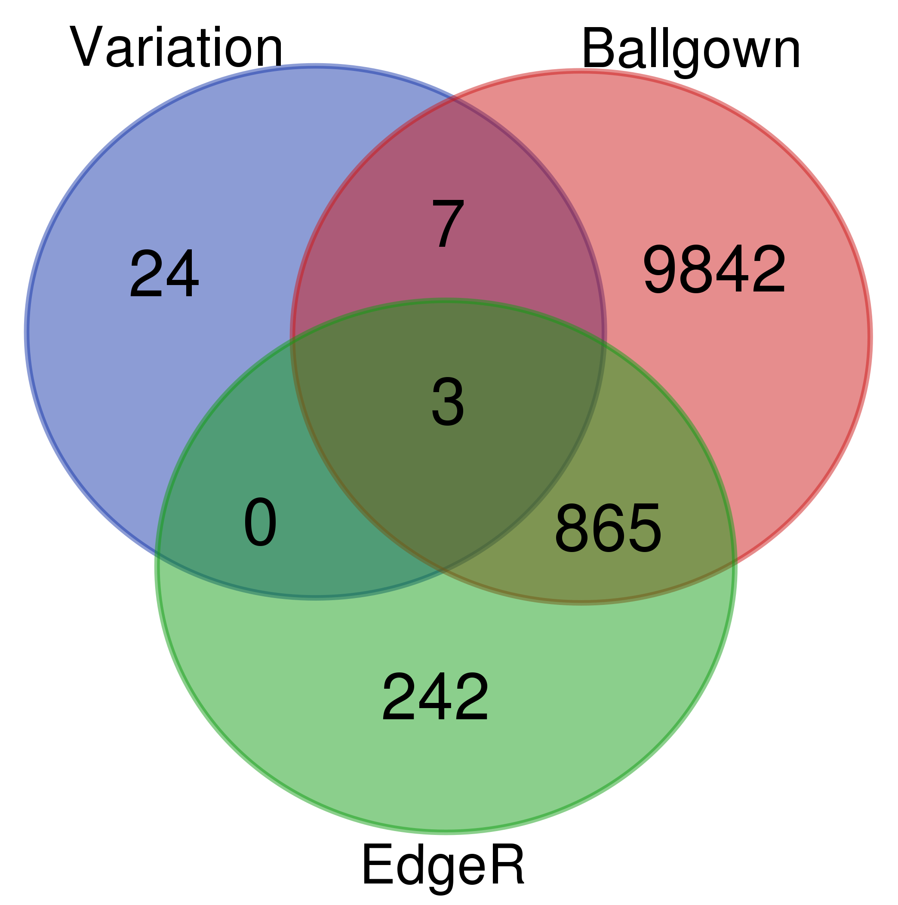

### Plots


